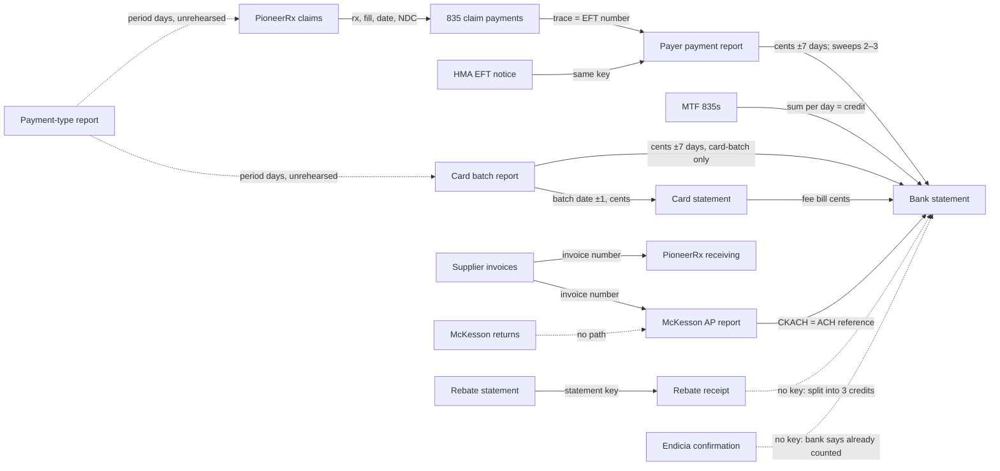

# The money map — how money and data come in, and where they land

**Phase A audit, read-only and measured. Written by session 2 for session 1. Phase B is split by file
ownership once session 1 has read it. A gap marked FIXED was fixed by its owner and re-tested here; the
entry names the commit.**

The owner, 15 September 2026: *"complete audit of money and data receiving, do we understand what
everything is, how to apply it, how to match it, are we setup to receive it properly and not get
errors … we need to understand how everything links together between claims, credit card fees, 835s,
expenses, bank statements, invoices, cogs, etc"*.

**Scope, the owner, later the same day:** *"we are just doing test run this month, it is fine if you dont have
everything, everything just needs to work and real record keeping happens 10/01."* So September proves each
feed works; a figure missing in September is not a gap. Two sample requests are **declined** (Q-SBP-1, Q-835-1).
Whether the books' start date moves to 1 October 2026 is a decision for him before then, raised by session 1.

**No real value is written in this map.** On 15 September the repository was found public with real prescription
records and the pharmacy's own identifiers in its tests (section 14). Identifiers below are shapes, counts or
last-four references to payer transactions only.

---

## How this was measured, so it can be re-run and disagreed with

- **Code** read at `origin/feature/compliance` **5cdff17**, and at **8394955** for the payment-type report
  added afterwards (both 15 September 2026). File and line references are to those commits.
- **Live numbers**: read-only SELECT queries against the live database, owner-approved 15 September 2026
  in the auditing session. The probe opens its own client and issues no PRAGMA, so it cannot write.
  Probes live in `scripts/support/probe-*.ts` for the length of the audit and are deleted afterwards.
- **Duplicate tests** (question 7): run against a **scratch snapshot** of the live database taken with
  `VACUUM INTO` at 16:15 UTC on 15 September 2026 — outside the repository and outside `data/`,
  owner-approved. Every writing probe refuses to start unless its database is that copy, and that guard
  was tested against the live path first (it refused, exit 2). The copy is deleted when the audit ends.
  After session 1's fix **6ad1c04**, the copy was deleted and taken again at **16:33 UTC** and the card
  tests re-run against the fixed code. After **c898bb4** it was taken a third time, at **16:48 UTC**.
  Section 1 · 7 says which run each result is from.
- **Masking**: no patient names, dates of birth or identifiers anywhere below. Processor batch numbers are
  shown last four digits only. Dollar figures are business totals.
- **Status words** follow CLAUDE.md rule 5: *captured · expected-not-yet · never-measured ·
  measured-and-none · not-captured*. "Missing" is not used.
- Figures attributed to **session 1** were measured by session 1 and are quoted, not re-measured, unless
  the entry says so.

Live row counts at the time of reading, for scale:

| table | rows |
|---|---:|
| claims | 3,923 |
| claim_payments | 9,585 |
| cash_receipts | 115 |
| expenses | 3 |
| supplier_invoices | 45 |
| invoice_lines | 468 |
| pioneer_purchases | 108 |
| supplier_statement_lines | 72 |
| bank_lines | **0** — no bank statement has ever been read |
| inbox_items | 136 |
| documents | 228 |

Cross-checks that the read was of the right database: 9,585 claim payments is exactly session 1's
figure from its post-deploy invariant check, and $34,112.41 of patient cash is exactly session 1's
card-batch total.

---

## 1. Credit card batches

**Checkpoint 1 of the audit. Code at 5cdff17, updated at 8394955 for the payment-type report; live
numbers and the scratch-copy tests 15 September 2026.**

### 1 · What it is, who sends it, how often, through which door

A settlement batch from the card processor (Global Payments / Heartland): one email per batch, sent by
staff from **@wwfppa.com**, subject `Credit Card Batch (<batch>, <m/d/yyyy>) Report: $<total>, <n>
Transactions`, with two HTML attachments. The Summary attachment is the table the reader uses.
`card-batch.ts` (pure), `card-batch-store.ts` (banks it).

**Door: the mailbox sweep**, in the branch for messages with **no acceptable attachment**
(`mailbox.ts` ~494). `.html` is not an accepted type (`autoroute.ts` 472), so a batch email has no
acceptable attachment and reaches this branch. Order inside the branch: postage → Health Mart Atlas EFT
notice → **card batch** → "declined" record.

**Frequency**: daily, business days. **Captured on live data**, 3–14 September:

| closed | day | total |
|---|---|---:|
| 3 Sep | Thu | $2,704.35 |
| 4 Sep | Fri | $4,614.73 |
| 5 Sep | Sat | $2,217.44 |
| 8 Sep | Tue | $4,229.27 |
| 9 Sep | Wed | $4,115.66 |
| 10 Sep | Thu | $5,769.36 |
| 11 Sep | Fri | $6,445.84 |
| 14 Sep | Mon | $4,015.76 |
| **8 batches** | | **$34,112.41** |

No batch for **1 Sep (Tue), 2 Sep (Wed), 12 Sep (Sat)**. None expected for 6, 7 (Labor Day) or 13
September: measured, no claim was sold on any of those three days. See gaps.

### 2 · Recognised automatically? Malformed or lookalike — loud or silent?

**Recognition is by subject alone** (`looksLikeCardBatch`, `card-batch.ts`), from any sender that passes
the mailbox's allow-list. Nothing earlier in the branch can claim a batch email: the postage reader needs
a registered postage vendor and the subject "purchase confirmation" (`postage-email.ts` 61–65); the EFT
notice reader needs its own subject and the sentence "electronic funds transfer for … is complete"
(`health-mart-eft.ts` 76–80). The vendor-bill rule sits in `importRecognised`, which this branch never
reaches, so a vendor registered with a @wwfppa.com address cannot turn a batch into a draft bill
(session 1's lead — checked, and not a risk for this feed).

Malformed input is **loud**: no Summary attachment → "Held, nothing stored … needs the Summary Report"
(store 27–28); a figure that will not read, or any self-check failing → "Not banked" with the reason,
written to the inbox line as *Held*.

**Live**: 8 inbox items carry a batch subject; **8 of 8** routed `card_batch`, status stored, none held,
none elsewhere. **Measured-and-none** misrouted.

**Not yet observed: the automatic door on its own.** All 8 receipts were created by **"Session 1,
backfill"** within 87 ms at 15:30:12 UTC on 15 September. The sweep's handler code ran — the inbox lines, the audit events and the receipts are all
the `bankCardBatch` path — but it was invoked by a backfill (the caller passed that name), not by the
scheduled sweep. The emails arrived 15:16–15:18; the backfill banked them twelve to fourteen minutes later.
The first proof that a batch banks with nobody's hand on it is the next batch email arriving by itself.

**One silent path exists in code and has not occurred.** `.png`, `.jpg` and `.pdf` *are* accepted types.
A forwarded batch email that picks up an image (a mail-client signature, an inline logo) has an
acceptable attachment, so it takes the attachment branch instead, and `bankCardBatch` is never called.
The image would be filed as an unrecognised document and the batch money would never bank, with nothing
saying a batch was missed. Measured: 0 of 8 affected.

### 3 · Read correctly? Do the self-checks run, and could they pass for the wrong reason?

Seven checks before anything is banked (`readCardBatch`, 85–125): the subject's batch number equals the
summary's; the totals row is readable; card types sum to the total; sales plus returns sum to the total;
credit plus debit sum to the total; the subject's amount equals the total; the subject's count equals the
summary's.

**Three of the seven compare against the email subject** — its batch number, its amount and its
transaction count — which does not come from the HTML table, so a misread table cannot agree with itself
and pass. Returns are negative and already inside the total
(verified by the reader's own note on the 8 September batch: $4,262.08 sales − $32.81 returns =
$4,229.27, which is the live receipt above).

**Fragility, fails loud**: `cellsOf` drops empty cells (`.filter(Boolean)`), so a blank cell shifts the
eleven-cell stride. The card-type loop then reads a figure where a name should be, `int()` returns null,
the loop stops short, and "the card types come to …" refuses the batch. Loud, not wrong.

**What none of them can catch**: a processor report that is itself wrong. The independent check for that
is the bank deposit, which has not yet been read (`bank_lines` = 0) — and the card statement's deposit
cross-check, which has not yet run on a statement (0 card statement fee bills on file).

### 4 · Where it lands, and which date decides the month

`cash_receipts`, **kind `patient`**, payer "Card batch", `sourceKey card-batch|<batch>`, `reference`
= batch number, **`receivedOn` = the day the batch closed**, **`month` = that day's month**
(store 69–80). `out_of_books` follows `isOutOfBooks(closedOn)`.

**Live**: 8 of 8 in books (`out_of_books` = 0), 8 of 8 with the summary kept as a document.

The month is the **close date**, not the date the money reaches the bank. A deposit follows a business
day or two after close. Measured exposure so far: **0 batches** closed on the 28th or later — September is
not over. See gaps.

### 5 · Which basis reads it — exactly once on each?

**Cash: once.** `monthlyPL` cash revenue groups `cash_receipts` by kind (`profit-and-loss.ts` 364–376),
and kind `patient` is "Patient payments banked".
**Accrual: never.** Accrual revenue reads the System Sales Summary and the claims (285–349) and does not
read `cash_receipts` for revenue at all. Card takings are already in accrual as what patients paid at
pickup.

**Proven on the live numbers** — the site's own `monthlyAccount("2026-09", …)` run on the snapshot, with
this audit's synthetic test rows removed first:

| September 2026 | cash | accrual |
|---|---:|---:|
| Third-party | $275,121.78 | $202,679.48 |
| **Patient** | **$34,112.41** | $43,574.09 |
| Facilitator | $2,789.08 | — |
| Retail and OTC | — | $3,490.76 |

Cash "Patient payments banked" is **exactly** the 8 batches, and there are **0** patient receipts that
are not card batches. Accrual "Patient payments" ($43,574.09) comes from claims and the till and contains
no batch. **The two patient figures measure different things** — accrual is everything patients owed on
fills collected in the month, cash is card settlements for 3–14 September only — and their difference
cannot be split into cash, cheque, charge account and uncollected without a payment-type breakdown. It is
not a shortfall and must not be reported as one.

### 6 · What it matches to, on what key, and the match rate

| matched against | key | status |
|---|---|---|
| Claims (what patients owed) | day, `claims.sold_on` = batch close date | **Session 1 measured**, 3–14 Sep: $34,112.41 card against $37,321.21 owed by patients on claims sold those days, **91.4%** overall, 74–128% a day. Within a range, not to the penny: no tender breakdown exists. |
| Bank deposit | exact amount, ±7 days, one-to-one (`matchHeldDeposit`) | **expected-not-yet** — no bank statement read (`bank_lines` = 0) |
| Card statement batch line | batch date ±1 day and exact amount, not batch number — the email's batch ID and the statement's sequence number are different series (`card-statement-store.ts` 97–111) | **expected-not-yet** — no card statement read. Its own note: the first statement able to cross-check batches already on file is **October's** |
| POS tender (card / cash / cheque / charge) | PioneerRx "System Sales Totals By Payment Type": `card_net` (card less card refunds) against card-batch receipts with `receivedOn` inside the report's period (`sales-by-payment-store.ts` 74–90) | **reader built, nothing captured yet** — added in 8394955 after this checkpoint was first written. Live on 15 September: table `sales_by_payment` exists with **0 rows**, and **0** inbox items routed to it. The August sample session 1 read is not on the live database. The check has never run on real data. |

Unmatched on live data, classified:

| day | patients owed (session 1) | card batch | status |
|---|---:|---|---|
| 1 Sep | $2,485.43 | none | **expected-not-yet** — measured: no batch-subject email for this day anywhere in the inbox, and no item at all from @wwfppa.com received that day. It never arrived, rather than arriving and being misfiled. |
| 2 Sep | $3,319.09 | none | **expected-not-yet** — as above |
| 12 Sep | $1,428.25 | none | **expected-not-yet** — as above |

### 7 · Duplication — what stops the same money counting twice?

Run on the scratch snapshot, calling the site's real `addCashReceipt` (and through it the real
`gateDeposit`) and the real `matchHeldDeposit`, against real neighbouring rows. The bank-statement step
reproduces `src/app/(app)/money/bank.ts` 93–146 argument for argument; it is not a call to that module,
which is a signed-in action. Amounts and batch ids are synthetic.

**First run (code at 8394955, snapshot 16:15 UTC).** The bank line was given the placement `deposit /
retail / payer none` by hand rather than by the real classifier.

| # | scenario | result |
|---|---|---|
| A | the same batch report forwarded twice | **refused** by `sourceKey`. Also true on live data: the reader ran **16 times** over the 8 emails, banked 8, refused 8 as already on file. |
| B | batch banked first, bank deposit the next day | **confirms** the batch receipt; nothing new banked |
| C | bank statement read first, batch forwarded afterwards | **counted twice** — both banked |
| D | two batches settled in one deposit | **counted twice** — the deposit matched neither batch alone and banked as new `retail` cash on top of both |

Over-count $567.89 — exactly C ($234.56) plus D ($333.33). Cause of C: `bank.ts` 144 banked the deposit with
no `receivedOn`, so the window query in `addCashReceipt` and `withinWindow` could not see it.

**Correction to the first run, found on the re-run.** The hand-given placement is what the real
classifier returns only when the bank prints the name as **HEARTLAND**. The spellings the site has on
record from the real August statement — `HRTLAND PMT SYST TXNS`, `HRTI-AND PMT SYS/TXNS`
(`bank-descriptors.ts` header and its test) — do not match `RETAIL` in `bank-statement.ts` 188, which
has `\bheartland\b`. The real `placeLine` returns **unplaced** for them. So the first run proved C and D
for the clean spelling only. Which spelling the bank's CSV export carries is **never-measured**: the reader
takes CSV only, and the spellings on record came from a scanned PDF.

**Re-run (code at 6ad1c04, fresh snapshot 16:33 UTC).** The bank line was placed by the real `placeLine`,
with the copy's real payer and supplier names in its context. Three descriptions were tried, each with its
own amounts.

| # | scenario | `HRTLAND PMT SYST TXNS/DEPOSIT` and `HRTI-AND PMT SYS/TXNS` (identical results) | `HEARTLAND PAYMENT SYSTEMS DEPOSIT` |
|---|---|---|---|
| A | same batch forwarded twice | refused; 1 receipt carries the key | (same test) |
| B | batch first, deposit next day | placed unplaced → **confirms** the batch | placed retail → **confirms** the batch |
| C | deposit read first, batch forwarded after | deposit **left unplaced**, nothing banked; batch banked | deposit **banked as `retail`** dated 9/23; batch **refused** — "already banked under 2026-09-23" |
| D | two batches banked, then one deposit of both | **ambiguous** — names both batches, nothing banked | **ambiguous** — names both batches, nothing banked |
| E | *new:* one deposit of two batches read first, both batches forwarded after | deposit left unplaced; both batches banked | deposit **banked as `retail`**; **both batches banked** — counted twice |

Money genuinely in, per column, against what the tests added: scan spellings **$0.00 over** (twice);
clean spelling **$393.97 over — exactly scenario E**. **C and D as specified: $567.89 → $0.00 on every
spelling. FIXED by 6ad1c04.**

One more order, because the screen sends the unplaced lines to a person. The `/money` page lists them
under *"A deposit here is banked with the form above"* (`money/page.tsx` 428), and that form's action
(`bankIt`, 106) passes **no `receivedOn` and no `sourceKey`**. `gateDeposit` banks anything with no
source key without comparing it (`deposit-gate.ts`, *"Typed by a person: the bank statement is the record
and this does not argue with it"*), and a receipt with no date is outside every later feed's window.
Reproduced on the copy:

| # | scenario | result |
|---|---|---|
| H1 | batch banked, then the same deposit typed on `/money` (payer "Heartland") | **both banked** |
| H2 | deposit typed on `/money` first, then the batch forwarded | **both banked** |

Live exposure today: **measured-and-none** — all 115 receipts on the copy carry a source key and a
received date, and no bank line has ever been read.

**Third run (code at c898bb4, fresh snapshot 16:48 UTC).** Session 1's fix makes the batch report the one
door for card takings. A Heartland credit in any spelling now places as `card_deposit`, which confirms a
batch or stays unplaced, and never banks. The form refuses an amount a feed already banked around that
month. The gate refuses a feed's receipt beside a typed, undated one of the same amount in the same month.
Reproduced:
- `readBankStatement`, `bank.ts` 88–150, including the `claimed` set shared across one statement's lines.
- `bankIt`, `page.tsx` 96–119, with "This is different money" not ticked. Both are signed-in actions, so
  **the form's new check was proved by calling `automaticReceiptsLike`, the function `bankIt` calls, and not
  through the page.**

| # | scenario | all three spellings (identical) |
|---|---|---|
| A | same batch forwarded twice | refused |
| B | batch first, deposit next day | `card_deposit` → **confirms** the batch |
| C | deposit read first, batch forwarded after | unplaced, nothing banked; batch banks once |
| D | two batches banked, then one deposit of both | ambiguous, nothing banked |
| E | one deposit of two batches read first, batches after | unplaced, nothing banked; both batches bank once |

Over-count per spelling: **$0.00, $0.00, $0.00.**

| # | hand path (spelling does not enter it) | result |
|---|---|---|
| H1 | batch 9/17 banked, same deposit typed for September | **form refuses** — "already banked automatically from Card batch on 2026-09-17" |
| H2 | typed for September, then batch 9/18 forwarded | **batch refused** — "already typed in by hand for 2026-09" |
| H1b | batch closed 9/30 banked, deposit typed for **October** | **form refuses** (its search runs 7 days either side of the month) |
| H2b | deposit typed for **October** (the bank date, 1 Oct), then the batch closed **9/30** forwarded | **both banked** — the gate compares typed receipts within the same month only |
| H1c | batches 9/24 and 9/25 banked, their **combined** deposit typed for September | **both banked** — the form looks for one receipt of the exact amount |

Hand-path over-count: **$685.50 — exactly H2b ($535.35) plus H1c ($150.15).**

| # | one statement, one card deposit and one PSAO deposit of the same cents | result |
|---|---|---|
| K | an HMA receipt of $987.65 banked 9/19; no batch on file; the statement carries a Heartland credit and an Access Health credit, both $987.65, on 9/20 | card line **confirms the HMA receipt**; the Access Health line, finding it claimed, is left unplaced; the batch forwarded afterwards banks. **$0.00 over**, but the card line is linked to the wrong receipt, and the PSAO line is left unplaced, though its money is on file. |

K is $0.00 here only because the Access Health spelling on record names no payer the site knows, so it
stays unplaced. By the code, a PSAO line that did name a payer would be placed as a deposit and banked
beside the HMA receipt, because `gateDeposit` never compares a receipt with no source key. That variant is the HMA/835 class session 1 has put in the 835 checkpoint, and it was not run here.

**Fourth run (code at 56f0ce2 + 882307e, fresh snapshot 17:30 UTC)**, after session 1's fixes for G-CARD-9, -10
and -11. The reproductions follow the new code: a card deposit matched against `card-batch|…` receipts only,
and the form's check reporting combinations.
- A–E, all three spellings: **$0.00 over**.
- H1 refused. H1b refused. **H2b refused** by the gate: *"535.35 was already typed in by hand for 2026-10"*.
  **H1c refused** by the form: *"already banked automatically as 2 receipts together"*. Hand path: added
  $2,069.33, genuinely in $2,069.33.
- **K**: the card line stays unplaced (no batch), the Access Health line confirms the HMA receipt, and the
  batch forwarded afterwards banks. $0.00 over, **and each line linked to its own receipt.**
- One new behaviour, loud: in H2 the form refused a genuinely new $424.24. Two unrelated receipts already on
  the copy summed to it exactly ($313.13 from H1 and $111.11 from D). The person can tick "This is different
  money". The batch forwarded afterwards banked once. So H2's original order was not exercised this run; its
  gate path is the one H2b proves. How often real receipts produce such a coincidence: not measured.

### Gaps for this feed

**G-CARD-1. A bank statement read before a batch is forwarded counted that money twice. — FIXED, 6ad1c04.**
OBSERVATION (first run): `bank.ts` 144 banked a statement deposit with no received date, so a batch
forwarded afterwards could not see it. $234.56 banked twice.
SHOULD BE: one deposit is one receipt whichever record reaches the site first.
FIXED: `bank.ts` 144 now passes `receivedOn: line.on`. Re-run: the later batch is refused, $0.00 over.
Third run (c898bb4): in C nothing is banked from the bank line, which stays unplaced, and the batch banks
once. $0.00 on all three spellings.

**G-CARD-2. One deposit covering two batches counted the money twice. — FIXED: batches first in 6ad1c04, deposit first (scenario E) in c898bb4.**
OBSERVATION (first run): batches $111.11 + $222.22, then one deposit $333.33, banked as new retail cash.
Second run, E: the combined deposit read before its batches banked as `retail`, and both batches banked
beside it, $393.97 over.
SHOULD BE: one deposit is one receipt whichever record reaches the site first.
FIXED: third run, D ambiguous and E unplaced with nothing banked, then both batches bank once. $0.00 on all
three spellings. Whether this bank ever combines batches is still **never-measured**; the fix no longer
depends on the answer.

**G-CARD-7. When the bank statement read first, the card money kept the bank's label and month. — FIXED, c898bb4.**
OBSERVATION (second run, C, clean spelling): the deposit banked as `retail` dated 9/23, and the batch closed
9/22 was refused, so the money's line and month depended on reading order.
SHOULD BE: the line and period a receipt lands in follow what the money is, never which document was read first.
FIXED: a card deposit never banks. The batch report is the only thing that banks card takings, always
`patient`, always at the close date. Third run, C: the batch banks, and the line stays unplaced.

**G-CARD-8. Heartland deposits in the spelling on record were unplaced, and the screen's advice for them doubled the money. — FIXED for H1 and H2, c898bb4; two narrower cases open as G-CARD-9 and G-CARD-10.**
OBSERVATION (second run): `placeLine` ignored the descriptor's `card_settlement`, so `HRTLAND`/`HRTI-AND`
credits were unplaced and the page said to bank them with the form. The form passed no date and no key, so
H1 (batch, then typed) and H2 (typed, then batch) both banked twice.
SHOULD BE: the site's own instruction for a line must never be the step that counts money twice.
FIXED:
- every spelling places as `card_deposit`;
- the unplaced line says to forward the batch report and not to use the form;
- the page footer says a card deposit is never banked by hand;
- the ambiguous message no longer says "confirm it by hand".
Third run: H1 refused by the form (proved at `automaticReceiptsLike`), H2 refused by the gate.

**G-CARD-9. A card deposit typed under the bank's month, for a batch that closed the month before, still counts twice. — FIXED, 56f0ce2 (fourth run, H2b refused).**
OBSERVATION: third run, H2b. A deposit of $535.35 was typed for October (the day it reached the bank, 1
October). The batch that closed 30 September was then forwarded, and both banked. The gate's new check
compares typed receipts **within the same month only** (`addCashReceipt` queries `month = input.month`). The
form's own check runs 7 days either side of the month (H1b, the reverse order, is refused), but the gate's
does not.
SHOULD BE: one deposit is one receipt; the month boundary is exactly where card money crosses (a batch
closed on the last day lands in the bank on the first), so it is the case a boundary check most needs to hold.
DIFFERENCE: yes, in code and on the copy. Reachable only if somebody types a card deposit despite the
screen saying not to. Dollars on live: **measured-and-none** (no typed receipts).
Owner: `expenses.ts` `addCashReceipt` and `deposit-gate.ts` — **1**.
Proposed fix: query typed receipts for the batch's month **and the month after** (the same widening
`automaticReceiptsLike` already uses), and compare across both.

**G-CARD-10. A combined deposit typed with the form, beside the two batches it covers, still counts twice. — FIXED, 56f0ce2 (fourth run, H1c refused).**
OBSERVATION: third run, H1c. Batches of $70.07 on 9/24 and $80.08 on 9/25 were banked, then their combined
$150.15 was typed for September, and both banked. `automaticReceiptsLike` looks for one receipt of the exact
amount. The ambiguous bank line now says *"banking it with the form would count it twice"*, but the form
itself does not refuse it.
SHOULD BE: as G-CARD-9 — an instruction on the screen is not a control; the form is where the double is made.
DIFFERENCE: yes, in code and on the copy. Reachable only against the screen's own words. Dollars: **measured-and-none**.
Owner: `money/page.tsx` — **A**; `expenses.ts` — **1**.
Proposed fix: `automaticReceiptsLike` also looks for 2–3 automatic receipts summing exactly, the same search
`matchHeldDeposit` does, and names them.

**G-CARD-11. A card deposit can confirm a receipt that is not a card batch. — FIXED, 56f0ce2 (fourth run, K).**
OBSERVATION: third run, K. With no batch on file, a Heartland credit of $987.65 confirmed a Health Mart
Atlas receipt of $987.65 banked the day before. `matchHeldDeposit` confirms a single candidate whatever its
payer; the payer is only used to choose between several. In the same statement the Access Health line of
that amount then found its receipt claimed and was left unplaced. Money: $0.00 over in this run. The card
line is linked to the wrong receipt, and the PSAO line sits unplaced with its money on file.
SHOULD BE: a card deposit is evidence about card takings only; it confirms a card batch or nothing.
DIFFERENCE: yes. Needs two deposits of the same cents within 7 days, one card and one not. How often: **never-measured**.
Where the other line names a known payer, it would bank beside the claimed receipt. That variant is left
to the 835 checkpoint, as session 1 asked.
Owner: `deposit-gate.ts` — **1**; `money/bank.ts` — **A**.
Proposed fix: for `card_deposit`, restrict candidates to receipts keyed `card-batch|…` before counting them.

**G-CARD-12. An unplaced card deposit is never re-matched when its batch arrives. (Recorded for session 1, who found it.)**
OBSERVATION: third run, C and E. The bank line stays unplaced, and the batch forwarded afterwards banks the
money correctly. Nothing in `src` updates a bank line after it is written (measured in the second run), so
the line stays on the unplaced list saying to forward a report that has already been forwarded.
SHOULD BE: a list of work to do shrinks when the work is done; a stale instruction teaches a person to ignore the list.
DIFFERENCE: yes. Not a money error; a stale list.
Owner: `money/bank.ts` — **A**; the card batch reader, `card-batch-store.ts` — **1**.
Proposed fix: when a batch banks, link any unplaced `card_deposit` line of the same amount inside the
window, or have the list re-run `matchHeldDeposit` on unplaced credits each time it is drawn.

**G-CARD-13. The unplaced card-deposit line names the wrong day's batch report to forward. — FIXED, 54bee8c** (read in
the code, `bank.ts` 166: *"the batch reports for the days just before <date> … two to four days after it closes, so a
Monday deposit can be the previous Thursday's to Saturday's"*, which fits the 25 August measurements).
OBSERVATION: c898bb4's message is *"Forward the batch report for the day before ${line.on}"* (`bank.ts`,
card_deposit branch). Measured on August's real card statement against the real bank statement, one to one:
**0 of 25** batches closed the day before their bank credit. It was 2 days before for 16, 3 for 5 and 4 for 4.
A weekday batch reaches the bank two days later, and Monday's credits carry Thursday's, Friday's and
Saturday's batches (3 August: three Heartland credits).
SHOULD BE: an instruction names the thing to do. Pointing at the wrong day's report sends a person looking
for a report that belongs to a different deposit, or that does not exist, since there is no Sunday batch.
DIFFERENCE: yes, measured. Not a money error.
Owner: `money/bank.ts` — **A** (the line was written by session 1).
Proposed fix: name the amount, and the window the batch closed in, "2 to 4 days before", or better, list
the batch dates in that window with no batch report on file.

**August evidence on G-CARD-2 (combined deposits):** measured-and-none. All 25 August batches reached the
bank as separate credits of their own exact amount. The fix stands regardless.

**Order of forwarding.** Under c898bb4, reading the first bank statement before the three unforwarded
batches (1, 2 and 12 September) no longer counts anything twice; their deposit lines wait unplaced (G-CARD-12).
Still: **don't type a Heartland deposit in by hand** (G-CARD-9, G-CARD-10).

**G-CARD-3. A batch email that picks up an image attachment is never banked, silently.**
OBSERVATION: the batch reader runs only when a message has no acceptable attachment; `.png`/`.jpg`/`.pdf`
are acceptable. Measured: 0 of 8 affected.
SHOULD BE: a report the site recognises by its subject must not go unbanked because of something else
riding on the same email.
DIFFERENCE: code path exists; has not occurred.
Owner: `mailbox.ts` routing — **B**. **Phase B** (session 1, 15 September): not to be fixed now.
Proposed fix: test the subject with `looksLikeCardBatch` before choosing a branch, and run the batch
reader on the declined HTML whatever else is attached.

**G-CARD-4. The automatic door has not yet banked a batch by itself.**
OBSERVATION: all 8 live receipts were banked by a Session 1 backfill, not by the scheduled sweep.
SHOULD BE: a daily feed is proven by its first unattended arrival.
DIFFERENCE: not a fault — an unobserved state. **never-measured**. Check the next batch email's
`cash_receipts.created_by` is the sweep, not a person.
Owner: none; an observation to close.

**G-CARD-5. The payment-type check exists and has never run on real data.**
OBSERVATION: session 1 built the reader for PioneerRx's "System Sales Totals By Payment Type" (8394955,
RouteKind `sales_by_payment`, migration 0121). It books nothing and checks two things: the till's card
figure against the card batches, and prescription money against the claims. On the live database: 0 rows,
0 inbox items.
SHOULD BE: the card batch, the till's card takings and the bank deposit are one sum of money seen three
ways, and a daily reconciliation should hold all three to the cent.
DIFFERENCE: **expected-not-yet** — the owner is to send the reports daily. Two joins are **unverified until
real September reports arrive**, and either can make a correct day read as a discrepancy:
- **the day boundary**: a batch is dated the day it *closed* (`receivedOn` = close date), the report the day
  of *sale*. A batch closed after midnight, or one holding the last sales of the day before, lands on a
  different day from the till's figure;
- **reversals**: the prescription check takes claims with `reversedOn` null, and whether PioneerRx nets a
  reversal out of the same period the same way is unknown.
Owner: `sales-by-payment*.ts` — **1** (session 1, 15 September; not yet in the ownership table).
Proposed: nothing to fix yet. Measure both joins on the first week of real reports before either check is
trusted to say a day is wrong.

**G-CARD-6. Charge accounts.** The owner: *"rarely but sometimes they do and it is registered as an AR
charge."* Accrual is unaffected (the claim's patient amount counts at sale). Cash counts it when the
patient later pays at the till. The gap: the site holds no record of what is owed on accounts, and a copay
charged that day makes that day's card total look short against copays. How rare — **never-measured**.
The payment-type report now has a column for it (`A/R / Direct Dep`, stored as `account_cents`), so the
first real reports will measure charges *to* accounts. See Q-CARD-2 for the half they may not show.

**Q-CARD-2 (question for the owner, raised by session 1). Does PioneerRx's "System Sales Totals By
Payment Type" report include money a patient pays *onto* a charge account, or only charges *to* one?**
The A/R column shows charges to accounts; whether a later payment against the account appears anywhere in
this report is unconfirmed. It matters for the card check: if account payments do not appear, then on a day
a patient pays off an account by card, the card batch holds that money and the till's card figure does not,
and the check reports the batches as holding more than the till — a correct day read as a discrepancy. If
they do appear, the check holds. Only the report's behaviour, or PioneerRx, can say which.

**Q-CARD-1 — DECIDED by the owner, 15 September (via session 1): card money counts on the day the batch
closed.** He says it reaches the bank a day or two later. The code already does this. Measured on August's
real statements: close → bank credit is 2 days for 16 batches, 3 for 5, and 4 for 4. So the batches closed on
a month's last two to four days are cash in that month and reach the bank in the next.

### Not checked, said out loud

- The **Global Payments card statement** reader (5cdff17) against a real statement: none has been read.
  Audited in its own checkpoint.
- Whether any real deposit combines two batches (G-CARD-2, scenario E): needs a bank statement.
- Which spelling the bank's CSV export gives Heartland: never-measured. The runs cover the two spellings
  on record and the clean one. Any spelling that `card_settlement`'s pattern (`HRT[A-Z]?[LIT]?AND|HEARTLAND`,
  on squashed letters) misses would fall back to the generic rules, and that was not tried.
- `readBankStatement` and `bankIt` were not called; both are signed-in actions and were reproduced line
  for line (bank.ts 88–150, page.tsx 96–119 at c898bb4). `placeLines` (plural) was not exercised; it
  differs from `placeLine` only in consuming open bills and invoices, which a credit never touches.
- The "This is different money" tick was not exercised; by the code it skips the form's check entirely.
- The re-run's test rows stay on the scratch copy, not live, and go when the copy is deleted.
- Card sales after 14 September: none received at the time of reading.

---

## 2. The card processing statement (Global Payments / Heartland) — rehearsed

**Checkpoint 2, run as a rehearsal. The owner, 15 September: *"we have an example of everything we need..
we should be able to do test runs and make sure everything works"*. Code at 5cdff17 (reader and store),
with `bank.ts` at c898bb4.**

Samples used (the owner's uploads; nothing from them is in git):
- **the real August 2026 merchant statement** (7-page PDF);
- **the real August 2026 Emprise bank statement** (scanned PDF, 11 pages). No site reader takes it, so its
  Heartland lines — 26 credits and 1 debit — were read off the page images by eye and used only as an
  independent record to check the card statement against. The PDF holds 9 page images; the transactions
  end on the 9th with the daily balance summary, so the last two pages were not looked at.

Booking was rehearsed on a fresh snapshot (16:59 UTC).

### 1 · What it is, who sends it, how often, through which door

The processor's monthly statement, sent by staff from @wwfppa.com, which is also the batch reports'
domain. It carries:
- the month's fees by section: Visa, Mastercard, American Express and Discover pass-through, and Global
  Payments' own charges;
- one row per batch deposited;
- one fee auto-debit line.

Door: mailbox sweep → `classify` on the PDF's text (`autoroute.ts` 215) → `card_statement` →
`bookCardStatement` (`mailbox.ts` 908), ahead of the vendor-bill rule.
- **Rehearsed:** `classify` returns `card_statement` for the real sample.
- **Live:** the 10 PDFs already received from @wwfppa.com all reached `classify` (1 rebate report, 9
  AccessHealth payment PDFs), so nothing intercepts a PDF from that domain first.

### 2 · Recognised automatically? Malformed or lookalike — loud or silent?

Recognition needs three things in the text together: "Merchant Statement", a "Statement Period" with two
dates, and "Global Payments" or "Heartland" (`card-statement.ts` 78).
- The real sample is recognised.
- A scanned copy with no text layer is not: it is filed as "a PDF this does not recognise" and books
  nothing (synthetic test).
- A recognised statement whose own figures disagree is held with the reason, *"Held, nothing stored: …"*.
  That is loud.

### 3 · Read correctly? Do the self-checks run, and could they pass for the wrong reason?

**The real statement reads, and every check ran and agreed:**

| figure | read |
|---|---|
| period | 2026-08-01 to 2026-08-31, merchant …4875 |
| total deposits | $94,529.08 — 25 batch rows sum to it |
| total fees | $4,778.73 — 5 section subtotals sum to it: Visa $1,120.59, Mastercard $569.45, Amex $42.01, Discover $138.51, Global Payments $2,908.17 |
| processing summary | 2,430 transactions, sales $94,678.94, refunds −$149.86, net $94,529.08 = total deposits (the check ran) |
| fee auto-debit | printed 08/31/2026, $4,778.73 = total fees |

**Against an independent record, the bank statement:**
- **All 25 statement deposits equal a bank Heartland credit to the cent, one to one.** The 26th bank credit
  ($3,695.38 on 8/03) is July's statement's last deposit.
- So the reader's deposit figures are right, and in August **no deposit combined two batches**.
- Could the checks pass for the wrong reason? "Total fees" has to agree with the section subtotals and the
  printed debit; "total deposits" with the rows, the processing summary, and here the bank. That is four
  independent agreements.

118 money-bearing lines are read by no pattern. By their shapes (listed in the probe), all are per-card
fee detail inside the sections, and the subtotals already cover them.

Two quiet paths remain, shown only on synthetic shapes:
- the processing-summary check skips silently if its line is unfamiliar;
- an unfamiliar deposit-row shape outside the totals is ignored.

The real statement has neither.

**What the statement and the bank show about timing** (measured, August):
- batch close → processor ACH: 1 day, all 25;
- ACH → bank credit: 1–3 days (weekend ACHs post Monday);
- **batch close → bank credit: 2 days ×16, 3 days ×5, 4 days ×4.**
- The fee debit is printed for the month's last day. **July's fees ($5,183.71) left the bank on 3 August.
  August's ($4,778.73) are not on the August bank statement.** The fees leave the bank in the following month.

### 4 · Where it lands, and which date decides the month

Rehearsed on the copy, first **as it is**: the August 2026 statement is before the books, so it is kept and
nothing is booked.

Then **the same text with every date one year on** (August 2027 has the same days, so every date keeps its
day of the month):
- one bill, `GP-…4875-2027-08-31`, **$4,778.73**;
- invoiceDate 2027-08-31, paidOn 2027-08-31 (the printed debit date), confirmed;
- category "Card processing and bank fees" (operating), vendor "Global Payments (Heartland)".

The deposits are never booked; they are the batch reports' money (section 1).

### 5 · Which basis reads it — exactly once on each?

`expensesIn`: accrual by invoiceDate, cash by paidOn, confirmed bills only (`expenses.ts` 171). Rehearsed
with the real `monthlyAccount`:

| | accrual Aug | cash Aug | cash Sep |
|---|---|---|---|
| before the statement | absent (listed missing) | absent | absent |
| statement booked | **$4,778.73** | **$4,778.73** | absent |
| bank fee debit read, next business day 9/1 (`pays_bill`, then its audit event) | $4,778.73 | absent | **$4,778.73** |

Once on each basis. The cash month is the printed date until the bank statement is read, and the bank's date after.

### 6 · What it matches to, on what key, and the result

- **Statement batches ↔ card batch receipts**: batch date ±1 day and exact cents (`card-statement-store.ts`
  93–124). The rehearsal made receipts from 22 of the statement's 25 rows, plus July's real last deposit.
  It gave *"22 of its 25 batches match"* and named the 3 left out, with dates and amounts ($10,889.91).
  **Right.** It also said *"1 batch report on file for these dates matches no deposit"*, and that is
  **wrong** (G-CSTMT-2).
- **Fee bill ↔ bank fee debit**: exact cents among `GP-…` bills no bank line has claimed. August's
  $4,778.73 → `pays_bill`. July's $5,183.71 (no July statement on file) → unplaced, *"forward that month's
  statement"*.
- **Statement deposits ↔ bank credits**: not something the site matches. The bank line matches the batch
  receipt instead (section 1). Measured by hand above: 25 of 25.

### 7 · Duplication

| # | rehearsal | result |
|---|---|---|
| 3 | the same statement forwarded again | **refused**, 1 bill |
| 5 | **the month's fees typed on Spending first, then the statement** | **booked again — accrual August card fees $9,557.46**, twice $4,778.73 |
| — | a corrected re-issue with different fees (synthetic) | not booked; says the bill on file differs and to look at both |

### Gaps for this feed

**Re-rehearsal of G-CSTMT-1 to -4 at 54bee8c (fresh snapshots, 18:18–18:19 UTC), with the real August statement:**

| order | result | September cash card fees |
|---|---|---|
| statement first | booked **$4,778.73, dated 31 Aug, unpaid**; forwarded again, not booked; then the bank's 9/01 fee debit → `pays_bill` | absent → **$4,778.73** |
| the bank's fee debit first (left unplaced), then the statement | booked, and **the waiting debit linked: paid 9/01**; forwarded again, not booked | absent → **$4,778.73** |
| the fees typed on Spending first (9/03), then the statement | **the statement books nothing**, naming the bill on Spending | **$4,778.73**, once |
| year-on statement, 22 of 25 batch receipts and July's last batch on file | names the 3 missing batches; **no "matches no deposit" sentence** | — |

**G-CSTMT-1, -2, -3 and -4: FIXED, 54bee8c.** The August statement on live was read under the old rule ("out of books,
nothing booked"), so it books only when it is forwarded or read again; session 1 is telling the owner. One wording
remnant, not a money fault: `money/monthly/page.tsx` still heads the absent-costs list *"Record them on Spending"*,
above a card-fee line that now says not to.

**G-CSTMT-1. Fees typed on Spending, as the monthly account invites, are counted twice when the statement arrives.**
OBSERVATION: rehearsal 5, real fees: $4,778.73 typed on Spending, then the statement → **$9,557.46** of
August card fees. The statement's duplicate check looks only for its own bill number
(`card-statement-store.ts` 48). Until a statement is read, the account lists *"Card processing and bank fees
— … nobody sends an invoice for it"* (`profit-and-loss.ts` 579) under *"Record them on Spending"*
(`money/monthly/page.tsx` 127).
SHOULD BE: one month's fees are one expense, and the site's own instruction is never the step that doubles
money. The processor does send a monthly statement, so "nobody sends an invoice for it" is no longer true.
DIFFERENCE: yes, rehearsed. $4,778.73 in a month like August. Live: measured-and-none.
Owner: `profit-and-loss.ts` and `money/**` — **A**; `card-statement-store.ts` — **1** (built it).
Proposed fix:
(a) the absent-fees line says the fees come with the processor's statement after month end, to forward
and not to type;
(b) `bookCardStatement` holds, naming the bill, when a confirmed bill in that category dated in the
statement month has the same amount or a Global Payments / Heartland vendor.

**G-CSTMT-2. The batch check names a neighbouring month's batch as "matching no deposit".**
OBSERVATION: rehearsal 2. July's real last deposit ($3,695.38, a batch closed 7/30, on July's statement)
was on file, and the August check reported *"1 batch report on file for these dates matches no deposit."*
The statement is organised by deposit date, so its first batch closed on the last day of the previous
month (7/31). The receipt window starts a day before that (`card-statement-store.ts` 104), so the previous
month's last batch falls inside it. The same happens at the other end whenever a batch closes the day after
the statement's last batch date.
SHOULD BE: a check that fires on a correct month teaches its reader to ignore it, including the month it is right.
DIFFERENCE: yes, rehearsed with real structure. It will say it every month the previous month's last batch is on file.
Owner: `card-statement-store.ts` — **1**.
Proposed fix: count as extra only receipts no adjacent statement could hold. The simplest version: drop the
±1 widening from the extra count, and keep it for matching.

**G-CSTMT-3. The fees count in the wrong cash month until the bank statement is read, and permanently if the bank statement is read first.**
OBSERVATION: the bill is paid on the printed debit date, the month's last day. **Measured: the money leaves
the following month** — July's on 3 August, and August's not in August. Rehearsed: August's fees sit on
August's cash account until the bank line moves them to September. If the bank statement is read before the
card statement, the debit line is unplaced. Bank lines are kept by key and never re-placed (`bank.ts` 78),
so the bill keeps the printed date for good.
SHOULD BE: on the cash basis an expense is recorded on the day the money left the bank.
DIFFERENCE: yes. **$4,778.73 in the wrong cash month** for August's statement: every month, temporarily, and
permanently in the bank-first order.
Owner: `card-statement-store.ts` — **1**; `money/bank.ts` — **A**.
Proposed fix: (a) book the bill unpaid (`paidOn` null, "taken by auto-debit; the bank statement dates it");
(b) when a `GP-…` bill is booked, link any unplaced Heartland fee debit of exactly its amount and take its
date. Trade-off: with (a), a month whose bank statement is never read shows no cash fees at all. The account
already lists absent costs, so it would be visible.

**G-CSTMT-4. August's card fees, $4,778.73, leave the bank in September and are on no account.**
OBSERVATION: rehearsal 1, the August statement books nothing (before the books). The bank shows the fees
leaving the next month. When September's bank statement is read, that debit is unplaced and says to
forward the statement. Forwarded, the statement books nothing, so the line can never clear. Rehearsal 4
shows the same shape with July's $5,183.71.
SHOULD BE: cash accounting counts a cost in the month the money left the bank. August's $4,778.73 left in
September, so **September's cash account carries it**, whatever month the fees were earned in. And an
instruction on screen can be completed.
DIFFERENCE: yes: $4,778.73 on no account, and a line that can never clear. (First drafted as a question for
the owner; session 1 corrected it, rightly, since the SHOULD BE follows from the cash basis itself.)
Owner: `card-statement-store.ts` — **1**, fixing it with G-CSTMT-3: the fee bill is always booked unpaid,
including for a statement month before the books, and the bank debit dates it.

**M-CSTMT-1 (money, for the owner — not a data fault). August's card processing cost 5.06% of card deposits.**
OBSERVATION, from the real statement:
- **Global Payments' own charges, $2,908.17**:
  - a **2.15% discount rate** on all card volume (Visa $1,324.68, Mastercard $542.02, Discover $130.25,
    Amex $38.65);
  - **$0.3164 per transaction** (Visa $552.71, Mastercard $224.99, Discover $27.86, Amex $14.56);
  - $18.95 "monthly vs daily discount cost";
  - $33.50 "service & regulatory mandate".
- On top of those, **$1,870.56** of card-network interchange and assessments passed through at cost.
- 2,430 transactions, average $38.96.

SHOULD BE: on pass-through ("interchange-plus") pricing, interchange is the unavoidable part and the
processor's markup is the negotiable part. For a retail merchant turning about $95,000 a month, markups are
commonly quoted in tenths of a per cent plus a few cents a transaction. A 2.15% markup plus 32 cents is well
above that. This is industry pricing, not a figure the site holds, so it is offered as a reason to get quotes,
not as a finding.
DIFFERENCE: illustratively, at a 0.50% + $0.10 markup August's processor charges would have been about $716
rather than $2,908.17 — **about $2,190 a month, $26,000 a year**. That is illustrative, not a quote. Whether
the contract has a term or an early-termination fee is unknown.

### Not checked, said out loud

- The bank statement through any site reader: none existed for a scanned PDF at the time. The owner says
  Emprise cannot export CSV, QFX or OFX, so the scan is the only form, and session 1 is building its reader.
  Its Heartland lines were transcribed by eye, and a misread digit would show as an unmatched row. None did.
- The batch report's close date against the statement's batch date for the same batch: no August batch
  reports are on file. The ±1 day allowance is untested on real pairs until September's statement meets
  September's reports.
- More than one merchant account: the statement shows one (…4875) and the bank shows one Heartland
  reference. Not asked.
- July's card statement: not on file. The attribution of the 3 August $5,183.71 debit to July's fees rests
  on its being the only Heartland debit in August and on the pattern August's own fees follow.
- The year-on rehearsal changes only the year. Weekdays in 2027 differ, and no code reads them.

---

## 3. ProviderPay payer payment report and the Health Mart Atlas EFT notice — rehearsed

**Checkpoint 3. Code at c898bb4. Samples, from the owner's uploads:**
- the real ProviderPay payer payment reports for **1–31 August** (44 payments) and **1–9 September** (12);
- the real August bank statement's **20 Access Health and 15 ProviderPay credits**, read by eye as in section 2.

Rehearsed on a fresh snapshot (17:08 UTC). No real EFT notice text was used: stored notices are under
`data/`. The notice was built in the layout the reader's header quotes, carrying a real EFT number, amount
and date from the September report.

### 1 · What they are, who sends them, how often, through which door

- **Payer payment report** (CSV from the ProviderPay portal): one row per payment into the pharmacy's
  ProviderPay arrangement — payer, payment number, deposit date, payment date, amount, type, and match
  columns. Forwarded by staff, a date range each time.
  Door: mailbox sweep → `classify` by header → `payer_payments` → `importPayerPayments` (`mailbox.ts` 997).
  **Rehearsed: both real reports classify `payer_payments`.**
- **Health Mart Atlas "EFT completed" email**, daily, no attachment: the EFT number, the NCPDP, the
  amount, and the plans inside it. Door: the no-attachment branch of the sweep → `bankEftNotice`
  (`mailbox.ts` ~487). **Live: 2 received and banked** (11 and 14 September).

**What the rows are, measured against the bank** (August):
- the **20 "Health Mart Atlas" payments** (type COPY, number `EFT-…`) equal the **20 "ACCESS HEALTH/ACCESS HEA"
  bank credits** to the cent, one to one;
- the **24 direct-payer payments** (Argus, Express Scripts, DomaniRx, Tricare, Medicare-dual, RxCrossroads;
  type EFT) total **$135,053.52**, exactly the **15 "ProviderPay/EDI PYMNTS" credits**. They are singles or
  daily sweeps of 2, 3 and once 4 payments. On 8/26, four payments made $12,330.61 (session 1's example).

### 2 · Recognised automatically? Malformed or lookalike — loud or silent?

- Report: recognised by four header columns together (payment number, payer name, deposit date, payment
  amt). A row without a number, payer, readable date or readable amount is skipped with its row and reason.
  **Rehearsed: August skips 1 row, "the payment is zero"; September skips none.**
- Notice: subject *"Health Mart Atlas EFT completed"* and the sentence *"electronic funds transfer for m/d/yyyy
  is complete"* both required. **Rehearsed: a notice for another NCPDP is refused and says so.**

### 3 · Read correctly?

**August: 44 payments, $510,990.21. September 1–9: 12, $168,943.43.** Payer names as printed.
- **The independent check is the bank:** every HMA payment and the direct-payer total agree with the August
  bank statement to the cent (section 3 · 1).
- Amounts are parsed as text (`moneyCents`), so no float cent loss. Every figure agreed to the cent.

**The report's "Deposit date" is not the bank's date for HMA payments.** Bank date minus report date:
0 days ×13, +2 ×4 (Saturday report dates, credited Monday), −2 ×2, and **−6 ×1** ($15,041.00: report 8/26,
bank 8/20). For the direct payers the report date is the bank date.

### 4 · Where it lands, and which date decides the month

Each payment is one `cash_receipts` row: kind `third_party`, payer as printed, `receivedOn` = the report's
deposit date (or the notice's transfer date), month from that. `outOfBooks` comes from `receivedOn`.
**Rehearsed: August's 43 banked rows are all out of books; September's are in.** Key
`payer-payment|<payer lowercased>|<payment number>`, shared by the report and the notice.

### 5 · Which basis reads it

Cash only, as `third_party` receipts. The accrual account never reads cash receipts (it reads claims). So
once on cash and never on accrual, by the same code path as section 1 · 5. This checkpoint did not re-run
`monthlyAccount`.

### 6 · What it matches to

- **Report ↔ notice**: the shared key. Rehearsed below.
- **Receipt ↔ bank line**: `matchHeldDeposit` — exact cents, ±7 days, one to one, and combinations of 2–3
  since 6ad1c04. **Rehearsed on the real August bank lines** (reproducing `bank.ts` 88–150):

| bank lines | result |
|---|---|
| 20 Access Health, $375,936.69 | **20 confirm** the HMA receipts. All inside the ±7 days, the −6-day one included |
| 9 ProviderPay singles, $78,193.25 | 9 confirm |
| 5 ProviderPay sweeps of 2 or 3, $44,529.66 | ambiguous, named, **nothing banked** |
| 1 ProviderPay sweep of 4 (8/26), $12,330.61 | unplaced, nothing banked (session 1 is extending the search past 3) |
| confirmed against the wrong feed's receipt | **none** |

Nothing was banked twice from the bank. The six sweep lines stay on the unplaced list, and their money is
already on file.

### 7 · Duplication

| # | rehearsal | result |
|---|---|---|
| 1 | August report, first arrival | **43 banked, 1 refused** — see G-PP-1 |
| 2 | August report again | 0 banked, 43 already held |
| 3 | September 1–9 report again (already live) | 0 banked, 12 already held |
| 4a | report first, then the notice for the same EFT | *"1 already on file under its EFT number, so not banked again"* |
| 4b | a notice a dollar different from the held figure | kept the held figure; *"one of the two is wrong"* |
| 4c | notice first (dated 9/5), then the report (dated 9/8) | 1 receipt, **dated 9/5 — the first arrival's date is kept** |
| 4d | another store's NCPDP | refused, named |

### Gaps for this feed

**G-PP-1. A payer's second payment of the same amount within seven days is refused as a duplicate, so real money is not counted. — FIXED, 882307e (pushed, not deployed at the re-run).**
Re-run on a fresh snapshot (17:29 UTC): August report **44 banked, $510,990.21, 0 refused**; again, 44 already
held. On the August bank lines, the 8/28 $904.00 line now names both $904 receipts rather than confirming
the wrong one. Nothing banked. **The live database still holds 5 DomaniRx August receipts.** August is out of
books, so no account is affected: August is before the books start, and there is nothing to do.
OBSERVATION: rehearsal 1. The real August report holds two DomaniRx payments of **$904.00**: payment …4538
deposited 8/26 and payment …2227 deposited 8/28, with different payment numbers. The second was refused:
*"904.00 from DOMANIRX on 2026-08-28 is already banked as …4538 under 2026-08-26"*. **The live database shows
the same: 5 DomaniRx receipts for August, $10,780.08, against the report's 6, $11,684.08.** The cause is
`gateDeposit`'s cross-feed rule (`deposit-gate.ts` 133–137): same amount, within 7 days, and the same payer
head. It is applied even when both receipts carry different payment numbers from the same feed. The real bank
statement shows both: $904.00 inside the 8/26 sweep and $904.00 alone on 8/28. The 8/28 bank line then
confirms the 8/26 receipt, so **the bank reconciliation looks clean while the cash account is $904.00 short.**
SHOULD BE: a payer's own payment number is unique to the payment. Two payments with different numbers from
the same payer are two sums of money, however alike their amounts. Repeat identical amounts are ordinary for a
payer paying a fixed fee or a recurring claim.
DIFFERENCE: yes, rehearsed and live. **$904.00 in August** (out of books, so no current account moved). The
same rule runs on every in-books month. September 1–9 had no such pair; later September reports were not
among the samples.
Owner: `deposit-gate.ts` — **1**.
Proposed fix: in `gateDeposit`, when the incoming receipt and the held one both carry a reference of 6+ digits
**from the same feed** (same source-key prefix) and the references differ, they are different money: skip the
amount rule for that pair. Keep the amount rule across feeds, where one deposit really does carry different
references (an 835 trace against a portal payment number).

**G-PP-2. A deposit's date and month are whichever document arrived first.**
OBSERVATION: rehearsal 4c. The notice (dated 9/5) banked first and the report (9/8) was then recognised by key;
the receipt kept 9/5. In the other order it would carry 9/8. Measured in August: the report's own deposit date
differs from the bank by −6 to +2 days. How the notice's transfer date relates to the report's deposit date for
the same EFT is **never-measured** (no real notice and report cover the same EFT among the samples; the
reader's header says the same).
SHOULD BE: a receipt's date does not depend on reading order. On the cash basis the date that decides the month
is when the money reached the bank, and neither document is the bank.
DIFFERENCE: only when the two dates straddle a month end. None in August's sample. Dollars: one HMA deposit
per occurrence (August's ranged $1,119.93–$40,084.14).
Owner: `payer-payments-store.ts` / `health-mart-eft-store.ts` — **not in the ownership table**;
`money/bank.ts` — **A**.
Proposed fix: when the bank line confirms a receipt, move `receivedOn` and `month` to the bank date. The bank
statement becomes the date authority on cash, as it already is for the card fee bill (section 2 · 5). Until a
bank statement is read, the first arrival stands.

**G-PP-3. ProviderPay sweeps stay on the unplaced list though their money is on file.**
OBSERVATION: 6 of August's 15 ProviderPay lines, $56,860.27, are combinations. Five are named as ambiguous
("those receipts are this money"); the 4-payment sweep is unplaced. None is linked to its receipts, and none
ever clears (G-CARD-12's shape).
SHOULD BE: a line whose money is fully accounted for leaves the work list.
DIFFERENCE: not a money error; list noise, every month.
Owner: session 1 is building the ProviderPay account reader and the wider combination search.
Proposed: when the combination is unique and exact, link the bank line to all its receipts and mark it placed.

### Not checked, said out loud

- A real EFT notice's text: the reader's quoted layout was used. The two live notices were read and banked by
  the site on 15 September, but their stored text is under `data/`.
- The notice's transfer date against the report's deposit date for one EFT (G-PP-2).
- September reports after the 9th: live receipts to 9/10 came from a report not among the samples.
- The report's match columns (remit match, claim match, no-claim match, adjustments): stored, read by nothing.
  They are the 835 checkpoint's.
- The ProviderPay holding account's own history (Wells Fargo CSV): no reader yet (session 1).
- The recoupment debit on the bank statement (`SHA PROVIDERPAY/AUTO ACH`, $635.58 on 8/25): the recoupments
  checkpoint.

---

## 4. Plan 835 remittances (ProviderPay) — what could be rehearsed without a file

**Checkpoint 4. Code at 882307e. The owner approved, 15 September, read-only access for the audit's scripts to
stored files under `data/`, printing aggregates only.**

**Samples: no real plan 835 file is kept anywhere the site stores files.** A script read the first 400 bytes of
every file under `data/remits`, `data/remittances` and `data/files` (the document store, 360 files):
- 14 files declare an 835;
- 12 are the Medicare Transaction Facilitator's, in `data/remits/mtf/filed` (section 5's);
- one is a test file ("TEST PAYER INC", $24.68);
- one reads as nothing.

The 9,550 plan payment rows in the database were read from files that were not kept: April by "Folder read",
August by the owner. No row links a document. **So `parse835` and `importRemittance` could not be rehearsed
on a real ProviderPay 835.** Session 1 is finding one with the owner. What the posted rows themselves can
prove is below.

### What is on file (live, read-only)

| month | 835 rows | payer on every row | paid | out of books |
|---|---:|---|---:|---|
| April | 4,867 | "ProviderPay" | $381,341.52 | yes (test pull) |
| August | 4,683 | "ProviderPay" | $518,125.46 | yes |

- 90 distinct trace numbers: 40 shaped `EFT-…`, 50 plain numbers.
- No cash receipt was banked from any 835 (none keyed `835|…`). Every door used so far posts without banking:
  the folder read and the `/remits` page. The **mailbox** (email and the SFTP host) and the **intake drop**
  call `importRemittance(…, { bank: true })`.

### 1 · What it is, and whose money

A ProviderPay 835 names **ProviderPay** as the payer (N1*PR) on every remittance, for money that reaches the bank
two ways (section 3):
- **Health Mart Atlas** deposits. The 835's trace is the `EFT-…` number. **All 20 August `EFT-…` traces equal an
  HMA payment number in the payer payment report** (18 of 19 in April).
- **Direct-payer** deposits. The 835's trace is a plain number that equals **no** payment number in the report.
  **In August, 15 of them sum exactly to a direct-payer payment in the report within 7 days** (Argus, Tricare,
  Medicare-dual, RxCrossroads, DomaniRx). The other 13 sum to no report payment.

### 5 · Which basis reads it

- A plan 835 posts `claim_payments` with `revenueCents` 0 (`settles`): the claim already carries its
  remittance, so the accrual account is not moved.
- It reaches the cash account only through the receipt a banking door adds. Both halves by the code
  (`claim-payments.ts` 473–545).

### 7 · Duplication — rehearsed with the real posted remittances

Each August remittance was rebuilt from its own posted rows: trace, payer "ProviderPay", paid date, and the sum of
its payments. It was banked on a fresh snapshot (17:34 UTC) with exactly the arguments `importOneRemittance`
passes when `bank` is on (`claim-payments.ts` 546–572), through the real `addCashReceipt` and `gateDeposit`.

| the August 835 remittance | gate | count | dollars |
|---|---|---:|---:|
| trace = an HMA payment number | **refused** (reference rule) | 20 | $321,723.80 |
| amount = a direct-payer payment in the report, within 7 days | **banked beside it** | 15 | **$148,965.45** |
| amount and number match nothing in the report | banked | 13 | $47,436.21 |
| the same remittance read a second time | refused by its key | — | — |

One approximation, said out loud: the real code banks BPR02, the remittance total. The rows give the sum of
claim payments, which equals BPR02 only where nothing was held back at remittance level. For the 15, the sums
equal the deposit to the cent, which is that case.

### Gaps for this feed

**G-835-1. A ProviderPay 835 for a direct payer, arriving by mail, SFTP or the intake drop, banks the deposit a second time. — FIXED, d477ee4 (deployed).**
Re-run on a fresh snapshot (17:49 UTC), in two parts.
- **The door:** the real `importRemittance` with banking on, fed the one non-MTF 835 kept (the site's test
  file) with its payer renamed in memory and its own trace each run. "ProviderPay": posted 2, **not banked**.
  "MEDICARE TRANSACTION FACILITATOR": posted 2, **not banked**. A control, "SOME OTHER PLAN": posted 2,
  **banked**, so the test can tell the difference.
- **The gate's belt,** rebuilding August's 48 remittances as before and banking them straight through
  `addCashReceipt`: the 15 amount-matched are now **refused** ($148,965.45), and so are the 20 HMA by
  number. The 13 with no match would still pass the gate, but through the real door a ProviderPay 835 never
  reaches it.

Banked beside a report receipt: **$0.00**.
The finding as first recorded:
OBSERVATION: rehearsed with August's real posted remittances. 15 direct-payer remittances, **$148,965.45**, were
banked beside the payer payment report's receipts for the same money.
- The 835 names the payer "ProviderPay"; the report names "ARGUS HEALTH SYS" and the rest.
- The 835's trace differs from the report's payment number.
- `gateDeposit`'s cross-feed rule needs a matching reference, or the same amount with the same payer head
  (`deposit-gate.ts` 133–150), so it sees two different payers.

The other 13 ($47,436.21) bank too. Whether they are the same money as report payments of different amounts
is not proven. The reverse order (835 first, report second) meets the same rule, by the code; it was not run.
SHOULD BE: an 835 is the advice of a payment, not the payment. The deposit is recorded once, by the document that
records deposits: here the payer payment report and the EFT notice. A remittance advice arriving later adds
claim detail, never cash.
DIFFERENCE: yes, rehearsed. Had August's 835s come in through the mailbox, **$148,965.45 of receipts would have
been counted twice**. The matching report payments were deposited in August and early September, and the
September ones are in the books. The same would happen every month once ProviderPay 835s arrive by SFTP or
email. Live: measured-and-none so far (no 835 has come through a banking door).
Owner: `claim-payments.ts` — **not in the ownership table**; `mailbox.ts` routing — **B**; `deposit-gate.ts` — **1**.
Proposed fix: (a) an 835 whose payer is the PSAO (ProviderPay) posts its claim payments and **does not bank**,
because the report and the notice are the banking doors for that money; (b) belt and braces in the gate: an `835|…`
receipt with no reference match is compared by amount within the window **without** the payer-head condition,
and a match goes to a person.

**G-835-2. 835 claim payments and the deposits they belong to do not add up, and nothing says by how much.**
OBSERVATION: of August's 20 HMA remittances, whose trace equals the deposit's EFT number, the summed claim
payments equal the deposit for **2**. For the other 18 they differ. (April: 1 of 18.) The 20 remittances' payments
total **$321,723.80**; the 20 deposits their traces name total **$336,229.96** (deposited in August and
September).
SHOULD BE: a deposit is its claim payments less what the payer held back at remittance level. Each difference is
money with a reason (fees, DIR, recoupments, or claims paid on another advice), and it belongs on an account
or a list.
DIFFERENCE: **$14,506.16** between those 20 remittances' claim payments and their deposits, the deposits being
larger, explained nowhere on the site. It is a net figure: 18 remittances differ, in directions not measured
here. It can't be classified without the files: the remittance-level adjustments (PLB) were not stored
with the rows, and whether some deposits are split across several 835 files is not known.
Owner: `claim-payments.ts` — not in the table; the reconciliation plan in `docs/ASSIGNMENTS.md` ("claim → 835
line → deposit").
Proposed: when a real 835 sample is in hand, rehearse `importRemittance` and store the provider-level adjustments
per remittance, so this difference can be read rather than derived.
**Explained for one EFT, and the cause found — see G-835-3 (section 12).** EFT …5975 of 31 August: the 835 rows on
file total $366.53 against a deposit of $377.41. The AccessHealth report for the same EFT shows claim rows of
$378.15 and an adjustment of −$0.74. The 835 import dropped one repeated row ($11.62), and $378.15 − $0.74 =
$377.41. The August total ($14,506.16) is very probably the same cause across the other remittances. That is
**not proven**: no AccessHealth report for them is on file.

### Not checked, said out loud

- `parse835`, `importRemittance`, `payableOnly`, the balance check and the claim matching, on a real ProviderPay
  file: no file.
- April's pull is test data (out of books) and was not rehearsed beyond the trace counts.
- Whether ProviderPay will send 835s by SFTP or email at all: the SFTP folder holds a key pair from 9 September
  (not opened). What it fetches was not checked.

---

## 5. Medicare Transaction Facilitator (MTF) payments — rehearsed

**Checkpoint 5. Code at 882307e.** Samples:
- **the 12 real MTF 835 files** kept in `data/remits/mtf/filed`, paid 18 August to 10 September (read-only,
  owner-approved);
- the August bank statement's 14 "MTF PM NGS/MTF PMT" credits (read by eye, section 2).

Rehearsed on a fresh snapshot (17:39 UTC).

### 1 · What it is, who sends it, through which door

The Medicare Transaction Facilitator pays the Part D negotiated-price difference on Medicare claims, as an 835
per payment day. Door: the MTF CLI downloads into `data/remits/mtf`, and the facilitator sweep reads it with
`importRemittance` **without banking**. The same file arriving by email or the intake drop is read with banking
on (section 4).

### 3 · Read correctly?

All 12 real files parse and **every one balances**: 25 payment lines, BPR total $5,856.77.
- One file (24 August) pays $0.00: a payment and its reversal.
- The 8 August files total **$5,541.37 — exactly the live August MTF rows.**
- **Against the bank: every August MTF 835 with money (7) equals an MTF bank credit to the cent, on the same
  day.** The bank's 7 earlier MTF credits (3–14 August, $4,791.21) have no file; the CLI's first download is
  18 August.

### 4–5 · Where it lands, and which basis reads it

- `claim_payments`, source `mtf`, `revenueCents` = the payment. The facilitator pays on top of the plan, so it
  is new revenue.
- **Cash account:** where the month has **no** facilitator cash receipt, the MTF payments received in the month
  stand in as the facilitator line (`profit-and-loss.ts` 1003–1006). Where it has **any**, only the receipts count.
  **Live September cash facilitator line: $2,789.08 = the September MTF rows exactly.**
- Two September rows ($193.78) have no revenue figure. The account falls back to the payment, so cash is right.
- A bank statement places an MTF credit as `deposit/facilitator` and banks it (`bank-statement.ts` FACILITATOR
  rule): no receipt exists for it to confirm.

### 7 · Duplication and completeness

| # | rehearsal | September cash facilitator line |
|---|---|---|
| — | as live | $2,789.08 |
| 1 | the sweep re-reads all 12 real files | posted 0, 25 already held; unchanged |
| 2 | the real 8 September file ($5.36) arrives first through a banking door (intake or email) | **$5.36** |
| 3 | a bank export for 1–12 September carries the five MTF credits of those days ($1,232.94) | **$1,232.94** |

### Gaps for this feed

**G-MTF-1. One facilitator receipt replaces the whole month's facilitator money on the cash account. — (b) FIXED in d477ee4; (a) OPEN, A's.**
Re-run on a fresh snapshot (17:49 UTC), with the bank reproduction following d477ee4 (facilitator-paid
context):
- the real 8 September MTF file through a banking door: posted 1, **not banked**; September line stays **$2,789.08**;
- the mid-month bank export: all 5 MTF credits placed **already counted**, nothing banked; line stays **$2,789.08**.

What remains is (a), the all-or-nothing stand-in in `profit-and-loss.ts`, owned by **A**. **Nothing banks a
facilitator receipt automatically any more**, so only a facilitator receipt typed by hand on `/money` can
still trigger it. It is open against A.
The finding as first recorded:
OBSERVATION: the account uses MTF payments only while the month holds no facilitator receipt, all or nothing
(`profit-and-loss.ts` 1003). Rehearsed on September's real money:
- **one MTF 835 through a banking door** made the line $5.36 instead of $2,789.08, **$2,783.72 short, with
  nothing to correct it**;
- **a bank export to 12 September** made it $1,232.94, **$1,556.14 short** until a later statement banks the rest.

The account does not say which source it used.
SHOULD BE: each facilitator dollar counts once on the cash account, from whichever record holds it. A second
record of some of the money must not remove the rest.
DIFFERENCE: yes, rehearsed. The first case is reachable by forwarding one MTF 835 by email. The second by
reading any bank statement that ends before the month does, and a statement read on the day it is exported
always ends before the month does.
Owner: `profit-and-loss.ts` — **A**; `claim-payments.ts` (banking an MTF 835 at all) — not in the table.
Proposed fix: (a) replace all-or-nothing with per payment. An MTF payment stands in unless a facilitator receipt
holds it: the same trace (for an 835-banked receipt), or the same cents on the same day (for a bank line;
August, 7 of 7). (b) An MTF 835 never banks, whatever door it comes through, since its money is already on
the account through the stand-in. The same principle as G-835-1.

**G-MTF-2. An MTF bank credit with no remittance for its day can confirm another payer's receipt. — FIXED, 7b71c14 (deployed).**
Re-run (17:57 UTC): the $123.45 MTF credit is placed `facilitator_unmatched`, is not matched, and the HMA receipt
of $123.45 stays unclaimed.
The finding as first recorded:
OBSERVATION: at d477ee4, an MTF credit whose day's remittances do not equal it is placed `unplaced`, and
`bank.ts` then matches every unplaced credit against all receipts in the window. Rehearsed: an MTF credit of
$123.45 on 9/17, with no MTF remittance that day, **confirmed a Health Mart Atlas receipt of $123.45 from 9/16**.
The real HMA bank line would then find its receipt claimed and stay unplaced. Money: $0.00 over. Links: both
wrong.
SHOULD BE: a credit the site has identified as the facilitator's is evidence about facilitator money only, as
a card deposit is about card batches (G-CARD-11).
DIFFERENCE: yes, rehearsed. It needs the same cents within 7 days. The case that reaches it is the facilitator
credits with no file (August had 7 before the CLI started).
Owner: `money/bank.ts` — **A**; `bank-statement.ts` — not in the table.
Proposed fix: return a facilitator-specific kind from `placeLine`, and skip the receipt match for it, as
56f0ce2 does for `card_deposit`.

### Not checked, said out loud

- The CLI download itself, and whether the filed folder holds every remittance: September's rows on 11, 14 and
  15 September have no file in the filed folder. They were posted by the automatic check from a folder not
  examined here.
- Facilitator money on the accrual account: all MTF rows are unmatched to claims (their fills are July and
  August, before the books). The accrual side waits for fills inside the books.

---

## 6. McKesson: Accounts Payable report, Returns Details, and their invoices — rehearsed

**Checkpoint 6. Code at 7f89689.** Samples, read-only from the document store (owner-approved):
- **the real Accounts Payable Open & Closed Transactions report** received 11 September;
- **the real Returns Details report** received 15 September.

Rehearsed on a fresh snapshot (17:46 UTC). Note: session 2 built the invoice reader. This section audits the
feeds around it and does not re-prove that reader.

### 1 · What they are, who sends them, how often, through which door

From era@mckesson.com as zipped CSVs:
- the AP report, **weekly** (one received so far);
- the Returns Details, **daily** (five received, 11–15 September);
- two totals sheets beside each, recognised and deliberately not read.

Door: mailbox → `classify` by header → `ap_transactions` / `mck_returns` → `fileApTransactions` /
`fileReturnCredits` (`mailbox.ts` 1086–1109). **Neither books a cost.** The AP report is McKesson's own ledger:
when each invoice is due, whether it cleared, and the ACH it cleared under.

### 3 · Read correctly?

**AP report:** 63 rows, 0 unreadable, 0 without a due date.
- 27 "Closed – Cleared", all under **one ACH, …7740, cleared 7 September, $106,322.62**;
- 36 "Open – Pending Approval", all due 15 September, $141,857.92;
- every row's gross less its 2% discount equals its net (the reader refuses otherwise); discounts total $5,064.91.

**Independent check against the invoices the site read from McKesson's PDFs: 21 on both agree to the cent, 0
differ.** The other 42 ($142,036.21) are on the report with no invoice on file, and all 42 are in PioneerRx's
receiving record.

**Returns Details:** 67 items, 0 unreadable, 9 credit notes, **−$10,411.15**, all "Saleable Return". Handling
$58.80. 66 of 67 name the invoice the goods were bought on.

### 4 · Where it lands

`supplier_statement_lines`, keyed supplier + number + due date. Credits go in the same table, negative, with
status "Credited".

### 5 · Which basis reads it

**Cash cost of goods only** (`cash-cogs.ts`). McKesson is "covered", so its cash cost is exactly its cleared
lines, by clearing month, and nothing from its invoice dates or receiving. Supplier names fold to one key in all
three tables ("Mckesson" / "McKesson"), so coverage holds. Other suppliers (IPC, IPD, ParMed, Anda, JamsRX,
Xymogen) are counted from invoice dates and receiving, and the account names them.
`countedTwiceInCash` for September: **0 rows**. The accrual account does not read this table.

### 6–7 · Matching and duplication

| # | rehearsal | result |
|---|---|---|
| 1 | the AP report re-filed | 0 new, 63 updated; lines 72 → 72 |
| 1 | the returns report re-filed | 0 new, 9 updated (live: five daily copies, each "already held") |
| 2 | next week's report moves one open invoice's due date (…5034, $22,118.56) | **a second row**; after it clears, the old open row stays |
| 4 | the real ACH debit of $106,322.62 read from a bank statement, **as `bank.ts` builds the context** | **unplaced** — *"names Mckesson but no open invoice of theirs is for this amount"* |
| 4 | the same debit **with the ledger supplied** | `settles_ach` — *"covers 27 Mckesson invoices and comes to exactly this debit"* |

### Gaps for this feed

**G-MCK-1. The McKesson ACH tie is built and never runs: a real bank read leaves every McKesson debit unplaced and every McKesson invoice unpaid. — FIXED, 7b71c14 (deployed).**
Re-run on fresh snapshots (17:57 UTC), reproducing `bank.ts` at 7b71c14:
- the real $106,322.62 debit → `settles_ach`, agrees, covers 27 invoices. **0 marked paid, because none of that
  ACH's 27 invoices is on file** (the 27 McKesson invoices on file are later ones);
- a debit a dollar short → recorded unplaced: *"coming to 106322.62, and the bank took 106321.62 — worth a look"*;
- **next week's report, simulated** by clearing the 36 real open rows ($141,857.92) under one ACH: the matching
  debit → `settles_ach`, agrees, **21 of the 21 invoices on file marked paid** on the bank date; a dollar short
  → unplaced.

The finding as first recorded:
OBSERVATION:
- `placeLine` ties a McKesson debit to the invoices inside it only when its context carries the AP ledger
  (`bank-statement.ts` 229, `ctx.settled`). `matchContext` in `bank.ts` (21–47) never supplies it.
- Rehearsed with the real ACH: unplaced as `bank.ts` runs; `settles_ach` to the cent with the ledger.
- Even when placed, `bank.ts` has no branch for `settles_ach` (the `else` at 170 counts it as not placed) and
  marks none of its invoices paid.
- **Live: 27 of 27 McKesson invoices on file have no paid date.**

August's bank statement carries four such debits ($500,597.61).
SHOULD BE: the wholesaler's own ledger, the ACH reference and the bank debit are three records of one payment,
and reading the bank statement should join them, which is what the rule was written to do.
DIFFERENCE: yes, rehearsed. Not a double count: cash cost comes from the ledger either way. But the largest
debits on every statement stay on the unplaced list, and no McKesson invoice is ever shown paid.
Owner: `money/bank.ts` — **A**; session 1's matching engine (item 2 on its queue) is the natural home.
Proposed fix: pass `settled` from `supplier_statement_lines` in `matchContext`; add a `settles_ach` branch that
records the line as placed and stamps `paidOn` on the covered invoices.

**G-MCK-2. Return credits, $10,411.15 so far, reach neither account.**
OBSERVATION: credits are filed with status "Credited" and no clearing date. Cash cost of goods counts only
cleared lines, so they never reduce it. The AP report carries no credit rows. The 7 September ACH equals its
27 invoices exactly, though 6 credit notes ($8,526.77) were already on McKesson's returns report by
11 September. So those credits were not taken off that debit.
SHOULD BE: a wholesaler credit is money back when the wholesaler applies it: netted from a later payment,
listed as a credit on the account, or refunded. The cash account records it then.
**How McKesson applies these credits cannot be written from the data held → Q-MCK-1.**
DIFFERENCE: waits on the answer. The code has no path from "Credited" to any account, whatever the answer.
Owner: `ap-transactions.ts`, `cash-cogs.ts` — not in the ownership table.

**G-MCK-3. A changed due date leaves a paid invoice looking unpaid.**
OBSERVATION: rehearsal 2. The ledger key includes the due date, so an invoice re-reported with a new due date
becomes a second row. The old "Open" row is never updated, and after the new row clears, "not yet taken"
still counts **$22,118.56** that was paid. `countedTwiceInCash` does not see it: it checks cleared money only.
SHOULD BE: one invoice is one ledger line whose status moves; a payable already paid is not owed.
DIFFERENCE: in code, rehearsed. Whether McKesson ever moves a due date: never-measured (one report so far).
Owner: `ap-transactions.ts` — not in the table.
Proposed fix: key on supplier + invoice number (+ transaction type), and update the due date in place.

**G-MCK-4 (wording). After a bank read, "N not placed" counts lines that were placed.**
`bank.ts` 170 adds every `already_counted`, `own_transfer`, `confirms_standing` and `settles_ach` line to the
"not placed" number in the message. The list on the page (`lastStatementLines`) is right, because it reads
the recorded placement. Owner: `money/bank.ts` — A.

**Q-MCK-1 (question for the owner).** When McKesson credits a return, how does the money come back? Is it taken
off a weekly ACH, shown as a credit on the Accounts Payable report, or paid out separately? $10,411.15 of
saleable-return credits have been issued since 19 August.

### Not checked, said out loud

- McKesson's September bank debit for ACH …7740: no September bank statement. The tie above is rehearsed
  against the real ledger, not a real bank line; August's debits have no AP report beside them.
- The invoice PDFs themselves: the 21-of-21 agreement is the check used here.
- The weekly transition from open to cleared on a second real report: only one AP report exists.
- Cash cost of goods for September as a total was not recomputed this checkpoint.

---

## 7. PioneerRx "System Sales Totals By Payment Type" — rehearsed

**Checkpoint 7. Code at 8394955 (reader and store).** Sample: **the owner's real report for 30–31 August 2026**,
printed 15 September. Rehearsed on a fresh snapshot.

### 1–2 · What it is, door, recognition

The till's own split of a period's takings by how they were paid (cash, cheque, card, account, coupons, and a
returns column for each), by section: front shop, prescription customer payments, plan remit, and adjustments.
Sent daily by the owner. Door: mailbox → `classify` → `sales_by_payment` → `fileSalesByPayment`.
**Rehearsed: the real file classifies `sales_by_payment`.** Recognition is by its title in the first 2,000
characters. A report missing any of the nine payment columns, Totals or Tax Collected is refused, naming the
column.

### 3 · Read correctly? Could the checks pass for the wrong reason?

| figure (30–31 Aug) | read |
|---|---|
| cards | $3,768.82 less $181.23 refunded = **$3,587.59** |
| cash / cheques / accounts / coupons | $56.46 / $34.39 / $0.00 / $0.00 |
| prescriptions | patients $3,426.89, plans $43,919.34 |
| front shop | $234.00 plus $17.55 sales tax |
| total | $47,580.23 |

- Every row's payments equal its total plus tax.
- Every section's rows equal its printed totals row.
- **All payment columns ($3,678.44) = total − plan remit + tax, to the cent.**
- **A copy with one figure raised by $1.00 is refused**, naming the row and the two totals it breaks.

The checks compare the report with its own printed totals, and those come from PioneerRx, not the rows; so a
misread cannot agree with itself.

### 4–5 · Where it lands; basis

One row per period in `sales_by_payment`. **It books nothing on either basis**: it is a check.
- Rehearsed as it is: before the books, kept, nothing recorded.
- A year on: stored.
- The same period again: *"replaces that one"*.

### 6 · What it matches, and what could not be rehearsed

Its two checks are the till's card figure against the card batches for the same days, and prescription money
against the claims sold those days. **Neither could be exercised on this sample.** No card batch and no claim
for 30–31 August is on the site (the books start 1 September), and the batch closed 31 August is on the
September card statement, which does not exist yet. A year on, the checks correctly say *"no card batch report
is on file … cannot be checked yet"* and *"0 claims … against PioneerRx's $43,919.34"*.

**To rehearse them, one more sample is needed and PioneerRx can produce it today:** the same report run for
**3–14 September**. The site holds all 8 card batches for those days ($34,112.41) and the claims sold on them.
That single run would test both checks, including the two joins section 1 left unverified: batch close day
against sale day, and how reversals net.

### Gaps for this feed

None that the sample can show. One observation for the owner's run: the sample's file name begins
"Accrual_", which suggests PioneerRx offers this report on more than one basis. Which basis the daily reports
should use belongs with Q-CARD-2 (whether account payments appear).

### Not checked, said out loud

- The card and prescription checks (above).
- A report covering a single day, which is how the owner sends them: the sample covers two.

---

## 8. The other suppliers, and wholesaler rebates — rehearsed

**Checkpoint 8. Code at 7b71c14.** Samples:
- the invoices and PioneerRx receiving rows on file for IPC, IPD, ParMed, Anda, JamsRX and Xymogen;
- the real McKesson rebate statement on file (July, $9,706.52) and the three real bank credits that paid it
  (August bank statement, read by eye).

Fresh snapshot, 17:54 UTC.

### Suppliers without a ledger feed

**Cash cost of goods for September, from the real `cashCostOfGoods`: $136,551.40.** That is McKesson's ledger
$106,322.62, plus invoice dates $15,000.21 (IPC, IPD, ParMed), plus PioneerRx receiving where no invoice
arrived $15,228.57. `countedTwiceInCash`: 0.

That check matches exact invoice numbers only, so each supplier was also searched for the same delivery held
under two spellings or matching by amount:

| supplier | invoices | receiving | numbers equal | equal once letters/zeros removed | same cents, different number | receiving with no invoice |
|---|---:|---:|---:|---:|---:|---|
| IPC | 11, $10,283.05 | 14, $12,195.81 | 8 | 0 | 0 | 6, $4,197.26, all dated 1–3 Sep, before invoices began arriving on the 4th |
| IPD | 1, $3,255.70 | 2, $3,483.64 | 1 | 0 | 0 | 1, $227.94 |
| ParMed | 6, $1,461.46 | 14, $3,417.21 | 5 | 0 | 0 | 9, $2,049.02 |
| Anda / JamsRX / Xymogen | 0 | 1 / 2 / 1 | — | — | — | all, $8,754.35 |

- **No delivery is counted twice.**
- Of the invoices whose numbers match receiving, every IPC and IPD one agrees to the cent. Two ParMed
  invoices are **$4.83 and $1.57 above** their receiving rows; cash takes the invoice, which is what is paid.
- IPC's one letter-numbered invoice is a **−$199.00 credit memo**, with no receiving row, and reduces cash cost.
- Invoices on 14 September with no receiving row yet (IPC $2,279.83 and $203.67, ParMed $86.87) are
  counted from their invoices.

These suppliers stay on invoice dates, which the account says in words. Whether IPC's daily "Independent
Phar/WAREHOUSE" debits match those dates is for the bank rehearsal.

### Wholesaler rebates

**Where it lands, and which basis reads it** (`rebate-report-store.ts` 380–430, `profit-and-loss.ts` 487–503):
- the statement books a bill in "Wholesaler rebates", negative, dated the **period earned**;
- where the statement prints a paid date, it also books a cash receipt of kind `rebate`, keyed on the statement;
- **accrual:** the stated bill replaces the ladder's estimate in the month earned;
- **cash:** the receipt counts in the month it arrived, and the bill is dropped so it is not counted twice.

Rebate receipts are excluded from cash revenue and reduce cost of goods instead.

**Live:** July's statement gives a bill of −$9,706.52 dated 31 July, paid 19 August, and one receipt of
$9,706.52 received 19 August. Both are out of books.

**Against the bank:** the August statement shows the rebate as **three credits on 19 August: "HEW LLC/BRAND"
$1,109.76, "HEW LLC/GENERIC" $8,246.76 and "HEW LLC/FEES MISC" $350.00**. That is exactly the statement's own
brand, generic and fees split.

**Rehearsed:** the three real lines read against that receipt, with the real `placeLine` and
`matchHeldDeposit`, and the `/money` form's check for each:

| bank line | placed | matched | typed on /money |
|---|---|---|---|
| HEW LLC/FEES MISC $350.00 | unplaced: *"a deposit from nobody the site knows; bank it by hand with the payer"* | nothing | **form banks it** |
| HEW LLC/BRAND $1,109.76 | unplaced, same | nothing | **form banks it** |
| HEW LLC/GENERIC $8,246.76 | unplaced, same | nothing | **form banks it** |

### Gaps

**G-REB-1. A rebate paid as several bank credits is not recognised, and the screen's advice for it counts the rebate twice. — FIXED, 4c61e77.**
Re-rehearsed on a fresh snapshot (18:10 UTC) with the real `placeLines`: all three real HEW LLC credits are
placed `rebate_part`. They are not matched and not banked, and the line says the rebate statement banks the whole
rebate and not to bank these by hand. (The three lines stay unplaced rather than linked to the receipt, which
belongs to the matching engine.)
The finding as first recorded:
OBSERVATION: rehearsed with July's real rebate.
- The bank pays it as three "HEW LLC" credits that sum to the one receipt already banked.
- No descriptor knows "HEW LLC", so each is unplaced with *"bank it by hand with the payer"*.
- `matchHeldDeposit` looks for receipts summing to a line, never lines summing to a receipt, so the
  receipt is not confirmed.
- The `/money` form does not refuse any of the three amounts.

Typing them in would bank $9,706.52 a second time. If typed under any kind other than `rebate`, it would
count as revenue.
SHOULD BE: one rebate is one receipt, whether it arrives as one credit or three. The site's instruction for
a line must not be the step that doubles it (the principle of G-CARD-8).
DIFFERENCE: yes, rehearsed. July's rebate ($9,706.52) arrived this way. Whether every month's does is
never-measured: one bank statement is on file. Live exposure: measured-and-none (no bank statement read).
Owner:
- `bank-descriptors.ts` / `bank-statement.ts` — not in the table;
- `money/page.tsx` — **A**;
- the matching engine (many lines ↔ one receipt) — session 1's queue.

Proposed fix: (a) a descriptor for HEW LLC as McKesson's rebate, whose unplaced message says the rebate
statement banks it; (b) the matcher also tries 2–3 same-day lines from one counterparty summing to one
unconfirmed receipt, and links them.

### Not checked, said out loud

- Whether "HEW LLC" is McKesson's rebate entity in name: the identification rests on the three amounts
  equalling the statement's own split, to the cent.
- IPC's, ParMed's and Anda's bank debits against their invoices: waits for the bank reader.
- The ladder estimate itself (`earningSoFar`): not re-derived.

---

## 9. Postage (Endicia / Stamps.com) — rehearsed

**Checkpoint 9. Code at 7b71c14.** Samples:
- the three real Endicia purchase confirmations on file;
- the August bank statement's ten real Stamps.com card charges (read by eye).

### 1–4 · What it is, door, where it lands

Endicia emails a "Purchase Confirmation" with no attachment each time postage is bought by card. The mail sweep
reads the body (`postage-email.ts`), only from @endicia.com or @stamps.com and only with that subject, and
books one bill in "Postage and shipping": dated and paid on the purchase day, confirmed, keyed
`POSTAGE|<vendor>|<order number>`.

**Live:**

| received | from | on arrival | bill |
|---|---|---|---|
| 8 Sep | @endicia.com | "not for filing — nothing on it to file" | $100.00, 8 Sep (booked afterwards) |
| 10 Sep | @endicia.com | "not for filing — nothing on it to file" | $100.00, 10 Sep (booked afterwards) |
| 15 Sep | @endicia.com | **read and booked by the sweep**, order …5518 | $100.00, 15 Sep |

**Automatic since 15 September.** None before 8 September. A forwarded copy (from a staff address) would
not be read: the sender must be Endicia's.

### 5 · Basis

An operating expense. Accrual by purchase date, cash by the same date, since the card is charged that day.
The bank line is treated as the same money (`bank-descriptors.ts` postage rule, `alreadyCounted`).

### 7 · Duplication and completeness — rehearsed

The ten real August Stamps.com charges ($940.99), through the real `placeLine`:
- **all ten are `already_counted`**, and **no postage bill exists for any of them** (August has none on file);
- one is a **$40.99** charge from "Stamps.com El Segundo CA", a different merchant line from the $100.00
  top-ups;
- a September line for the 9/15 purchase (bill on file) → `already_counted`, which is right;
- a September line with **no confirmation behind it** → `already_counted`, which is wrong.

### Gaps

**G-POST-1. Every Stamps.com bank charge is called "already counted", whether or not anything counted it. — PARTLY FIXED, 0b61a0f; re-rehearsal failed on one case. Then FIXED, 54bee8c.**
Second re-rehearsal (fresh snapshot, 18:17 UTC), same September case: charges posted 9/09 and 9/11 → `already_counted`;
**9/12 → unplaced** (*"no Endicia or Stamps.com purchase confirmation on file"*); 9/16 → `already_counted`. Each bill now
covers one charge. (Session 1: 0b61a0f's consuming edit had not landed, which the first re-rehearsal caught.)
The first re-rehearsal, as recorded:
Re-rehearsed on a fresh snapshot (18:10 UTC), reproducing `bank.ts`' `postageBills` and running the real `placeLines`:
- **the ten real August charges ($940.99), with no bill on file: all unplaced**, with *"a postage charge with no
  Endicia or Stamps.com purchase confirmation on file"*. Passes;
- **September**: the three real bills (8, 10 and 15 Sep, $100 each) against bank charges posted 9 Sep, 11 Sep,
  **12 Sep** and 16 Sep. **All four are placed `already_counted`**, though there are three bills. The 12 September
  charge has no confirmation, and it is absorbed by the 10 September bill, which already counted the 11 September
  charge.

The commit says *"one charge each"*, but `placeLine` tests `postageBills.some(…)` and `placeLines` never removes
a bill once used, as it does for open bills and invoices. Postage top-ups here are the same $100 every two or three
days (August), so an unconfirmed charge will usually sit within three days of a confirmed one.
**Still open: $100.00 per unconfirmed charge near a confirmed one.**
Proposed fix: consume the bill in `placeLines`, as `unpaidBills` is, or record the bank line against it.
The finding as first recorded:
OBSERVATION: the postage rule marks the bank line already counted unconditionally. Rehearsed with the ten
real August charges: all $940.99 placed `already_counted` with no bill for any, and the same for a September
charge with no confirmation email. A missed or unsent confirmation (the 8 and 10 September emails were at
first filed as nothing to file), or a charge that is not a top-up (the $40.99 El Segundo line), is dropped
from the books with a sentence saying it is on them.
SHOULD BE: "already counted" is a claim about a record, and it holds only where that record exists. A card
charge with no bill behind it is postage nobody has booked, and the line should say so.
DIFFERENCE: yes, rehearsed. Dollars: every Stamps.com charge without its email, of which August shows the
shape (10 charges, $940.99, a month). How many of September's charges have an email: measured-and-none so
far, because the September bank statement is not in yet.
Owner: `bank-descriptors.ts` / `bank-statement.ts` — not in the ownership table.
Proposed fix: already counted only when a postage bill of the same amount exists within 3 days of the bank
date and no bank line has claimed it (the card-fee rule's shape). Otherwise, unplaced: *"a postage charge
with no Endicia confirmation on file"*.

**Q-POST-1 (question for the owner).** What is the **$40.99 "Stamps.com El Segundo CA"** charge on 18 August:
the Stamps.com subscription, or postage? One such charge was measured; whether it recurs is not known. If it is the subscription, no confirmation email will ever
book it, and it needs a standing cost or a vendor bill.

### Not checked, said out loud

- Whether Endicia sends a confirmation for every purchase: the September bank statement will show it.
- An Endicia confirmation carrying a surcharge: none of the three does.

---

## 10. RedSail copay-voucher remittance (the scanned sample) — reader built, rehearsed

**Re-checkpoint 10. Reader `copay-remit-scan.ts` at 8b14cc1 (branch `work/accesshealth-reader`), built on the
finding below.** What follows this part is the first measurement, kept as it was.

**What the reader does.** The page's words carry their positions, so the printed lines are rebuilt from them (the
scanned bank statement's `rowsOf`) and handed to the existing `parseCopayRemit`. That parser checks each row
(submitted less the patient's share is what is paid) and the rows against the printed payment. Scanner damage is
repaired only where something proves the repair:
- a character inside a row's figures ("I" for 1, "s" for 5 or 8), only where exactly one reading passes the row's
  own arithmetic;
- the payment date's slash read as a 1 ("09/01 12026");
- the check/ACH number: a streak down the scan's left margin breaks its label ("ChecUACH") and cuts the number into
  groups. The groups are joined, never read differently. The page image was looked at for this line only: the
  number is printed as one run.

A PDF whose text layer already reads is used as it is. `mailbox.ts` passed a PDF's raw bytes to the importer, so
**no PDF voucher could ever import** before this; it now passes the rebuilt text.

**Rehearsed on a fresh snapshot, with the real scan:**

| rehearsal | result |
|---|---|
| `classify` | `copay_remit` (was unrecognised) |
| the rows | 14 rows, netting by prescription to **2 payments, $177.25 = the printed payment**; payment date 1 September 2026 |
| against the fixture `copay-remit-redsail.txt` | every row's money identical, as a multiset |
| first read | 2 payments recorded (both fills from August, before the books start, named as such); **banked once, $177.25** |
| read again | **2 already held, 0 posted, nothing banked** |
| read again, before the check-number repair | **both payments posted a second time.** The duplicate check keys on the check number, and the scan had lost it |
| on live before the rehearsal | 0 copay receipts: this voucher is not on file |

**G-COPAY-1. The copay-voucher fixture carries two of the pharmacy's real identifiers.**
OBSERVATION: `fixtures/copay-remit-redsail.txt` (5157f86, 8 September) says in its header that the check/ACH
number and the NPI are invented. Compared by script with the real voucher: **the check/ACH number and the NPI are
the real ones.** Its prescription numbers are not (no patient-linked value is shared). The NPI also appears in
`docs/HANDOFF.md`, `tests/bank-descriptors.test.ts` and `tests/x12-835.test.ts`.
SHOULD BE: CLAUDE.md, "a feed's shape goes in `fixtures/` with every identifier changed". A pharmacy's NPI is
public, but the rule does not make an exception for it, and a check number is a banking reference.
DIFFERENCE: yes: two real identifiers are in git, pushed on every branch cut since 8 September. Force pushes are
refused, so history keeps them whatever is done.
Owner: the fixture has no owner in the table (session 1 last edited it).
**Question for session 1 / the owner:** is the pharmacy's own NPI allowed in tests (it is in three other files), or
should all four be changed? The check number can be changed in the fixture and `tests/copay-remit.test.ts` alone.
**Answered by session 1:** the rule makes no exception, and the fixture's own words were false. Change all of them.
**FIXED 8430873.**
- The fixture and `tests/copay-remit.test.ts` now carry an invented check/ACH number of the same length, and an
  invented NPI with a valid check digit. So do `tests/bank-descriptors.test.ts` and `tests/x12-835.test.ts`; no
  test depended on the exact value.
- `HANDOFF.md` names the NPI without giving it.
- Checked by script: 0 tracked files hold either real value; the four suites pass (102 tests).
- **Earlier commits still hold the real values** (from 5157f86, on every branch cut since 8 September). Force pushes
  are refused, so history is not rewritten.
- Not checked: other real identifiers of the pharmacy's own in tracked files. The NCPDP number, for one, is in
  `HANDOFF.md` beside where the NPI was; session 1 did not ask for it and it was left.

**Not checked, said out loud:**
- A voucher that matches a claim on this site: both payments here are for August fills, so `matched` is 0.
- The voucher's deposit against the bank: it is dated 1 September, and no September statement is on file.
- A scan whose check number the streak damages differently (a digit lost, not just split): the groups would join
  into a wrong number, and a second read would still be caught (the same scan reads the same way), but a text
  copy of the same voucher would not.
- Page 2 of the PDF was not viewed.

**The first measurement (before the reader):**

**Checkpoint 10.** Sample: the owner's upload `Image_001.pdf`, a RedSail copay-voucher remittance. It was measured
by shape only: every word reduced to its length and every digit masked, because a voucher can carry
patient-linked rows. The page images were not looked at.

**What the file is:**
- 2 pages, each one scanned image of about 3,400 × 4,400 pixels (about 400 dpi on letter paper);
- a text layer is present;
- no OCR producer is named in the file.

**Is the text layer readable?** Mostly.

| measure | value |
|---|---|
| characters / lines / tokens | 2,014 / 130 / 227 |
| clean words | 74 |
| money-shaped figures | 15 clean tokens; 64 figures found in the text |
| garbled tokens (letters and digits mixed, or non-printing) | 28 (12%) |
| labels present | Payment, Total, Amount, Date, Voucher, Copay, RedSail, Remit, Pharmacy, Rx, Paid |
| the payment figure | $177.25, printed at the top and again at the foot |

The figures follow a remittance's pattern: charges with their reversals (+$1,177.90 / −$1,177.90,
+$1,350.00 / −$1,350.00, and so on), handling amounts ($2.00, $0.25, $28.00), and a net of $177.25.

**What the site does with it:** `classify` → **unrecognised**; `looksLikeCopayRemit` → false. The text comes
out one field per line, so the reader's row pattern never forms.

**Answer for session 1's OCR decision:** for this document **the text layer already carries the figures,
largely clean**. OCR is not the missing piece. A reader that rebuilds rows from this layer's field order
is. Whether every row's fields are present and in order could not be proven by shape alone, since the row
text is patient-linked, and was not read.

**Against the bank:** August's RedSail credits (8/04 $225.22 and $67.50; 8/11 $501.97; 8/18 $2,324.01; 8/25
$1,375.98) include no $177.25. The voucher's own date was not printed, so which month it pays is not
established.

No gap is written: nothing was read, so nothing was stored wrongly. The state is **not-captured**, because
there is no reader for this layout.

---

## 11. Every route the mailbox takes, and whether anything drops silently

**Checkpoint 11. Code at 7b71c14; live inbox read-only.**

**Everything the mailbox has recorded (136 items, 4–15 September):**

| route | status | items | note |
|---|---|---:|---|
| invoice | stored | 45 | supplier invoices |
| on_hand | stored | 12 | |
| report_summary | stored | 11 | McKesson totals sheets, recognised and deliberately not read |
| pioneer_catalog | stored | 10 | |
| rx_transactions | stored | 9 | daily claims |
| purchase_drilldown | stored | 9 | |
| card_batch | stored | 8 | section 1 |
| training_reply | stored | 7 | |
| mck_returns | stored | 5 | section 6 |
| payer_payments | stored | 2 | the HMA EFT notices, section 3 |
| ap_transactions, postage, rebate_report, return_policy | stored | 1 each | |
| empty_report | stored | 1 | a daily claims report of 13 September (a Sunday) carrying "No Data", recorded as a fact rather than a failure |
| **unrecognised** | stored | **9** | all "Fw: SECURE: AccessHealth Payment Data" PDFs; session 1 is building that reader |
| not_for_filing | ignored | 5 | the two early Endicia confirmations (section 9); a reply about trainings; a login email; an Rx Systems shipment notification |

**Routes the code has that nothing has taken yet:** remittance_835, copay_remit, card_statement,
sales_by_payment, claims, accrual_sales, rxrescue_credit, supplier_catalog, nadac. Their readers are
rehearsed in sections 2, 4, 5, 7 and 10 where a sample existed.

**Exits in the sweep that leave no inbox row** (`mailbox.ts` 167–403):
- a message with no source (170);
- a message already recorded (178);
- **a message sent from the mailbox's own address** (190–193). Left unread on purpose, so staff mail sent to
  that address is not consumed, but it is also never read as a report.

Every other exit writes an inbox row with its reason:
- sender not allowed (the allow-list is **empty**, so every sender is accepted);
- a bounce;
- nothing attached;
- over 20 MB;
- refused by the PHI gate.

**Observations, not gaps:**
- If anyone forwards a report *from the mailbox's own account* (a Gmail address), it will sit unread and
  unrecorded with nothing said. Whether anyone does is **never-measured**: the skip leaves no trace, so a count
  of zero proves nothing.
- The sweep reads the newest 50 unread messages each time. Self-sent messages stay unread for ever, so enough of
  them would push older unread mail outside that window.
- The Rx Systems "Shipment Notification" (filed as nothing to file) comes from a vendor the August bank paid
  $2,577.99 on 20 August. Its bill does not arrive by this route.

### Not checked, said out loud

- The SFTP door: its folder holds a key pair (not opened), and what it fetches was not examined.
- The Inbox screen's "resort" and "undo" paths (`inbox-resort.ts`, `inbox-undo.ts`) were not rehearsed here.

---

## 12. Health Mart Atlas AccessHealth payment reports — reader built and rehearsed

**Checkpoint 12. Built by session 2 on branch `work/accesshealth-reader` (403985f), at session 1's request.** Samples:
the **9 real "Fw: SECURE: AccessHealth Payment Data" PDFs** in the document store, read read-only. Nothing
patient-linked was printed while designing it: words appearing in fewer than 7 of the 9 files and every Rx digit
were masked.

### What it is

Each report is one Health Mart Atlas EFT, itemised:
- the EFT number and Total Paid;
- one section per plan, with claim rows of fill date, Rx, billed, allowed, dispensing fee, tax, co-pay,
  amount and a rejection code;
- remittance-level "Adj-" rows, codes from the report's own glossary;
- each section closed by "Paid claims: n Paid Amount: $x".

### Read correctly — the rules, measured on all 9 real reports

- a section's Paid Amount = its claim rows' amounts + its adjustments;
- a section's Paid claims = its claim rows + its adjustment rows;
- the sections' Paid Amounts = the EFT's Total Paid.

**All 9 close to the cent** under those rules, and the reader refuses any report that does not. Plan names are
printed twice, above the section and after its footer, and three of the nine break a page between a plan's name
and its rows. The reader takes the last text line since the previous footer. A section named like the one just
closed is refused rather than guessed.

| EFT (report date) | total | plans | claim rows | adjustments | deposit banked for that EFT |
|---|---:|---:|---:|---|---|
| …5975 (31 Aug) | $377.41 | 5 | 23 | AH −$0.74 | $377.41, 1 Sep — agrees |
| …0121 (1 Sep) | $21,175.45 | 4 | 510 | CS −$1.16 | $21,175.45, 2 Sep — agrees |
| …4855 (2 Sep) | $25,006.44 | 5 | 647 | AH −$64.30 | $25,006.44, 3 Sep — agrees |
| …9473 (3 Sep) | $452.83 | 2 | 2 | AH −$0.06 | $452.83, 4 Sep — agrees |
| …4994 (4 Sep) | $37,909.27 | 9 | 597 | AH −$1.16, CS −$3.35 | $37,909.27, 8 Sep — agrees |
| …0312 (8 Sep) | $27,727.70 | 5 | 513 | AH −$2.90 | $27,727.70, 9 Sep — agrees |
| …5402 (9 Sep) | $21,094.87 | 4 | 477 | AH −$73.04 | $21,094.87, 10 Sep — agrees |
| …0491 (10 Sep) | $5,942.36 | 3 | 70 | none | **none on file** |
| …5651 (11 Sep) | $24,559.62 | 8 | 620 | none | $24,559.62, 11 Sep — agrees |

**8 of 9 EFT totals equal the deposit banked for them, to the cent.** The report is dated one to four days before
the deposit. EFT …0491 ($5,942.36, 10 September) has no deposit on file: the payer payment report received
covers only to the 10th, and no EFT notice for it arrived. Its state is **expected-not-yet**, which the next
payer payment report will settle.

### Where it lands, basis, duplication

`claim_payments`, one per non-zero claim row:
- source `plan`, payer "Health Mart Atlas", **revenue 0** (the claim already carries its remittance), reference
  `EFT-…/<rx>`;
- dated by the deposit where one is on file, else by the report;
- **nothing banked**: the payer payment report and the EFT notice are the banking doors;
- a report whose total differs from its EFT's deposit is refused.

**Rehearsed on a fresh snapshot (18:31 UTC):**

| rehearsal | result |
|---|---|
| all 9 through the real `classify` | `accesshealth_payment` ×9 |
| first read | **2,135 claim payments posted**, revenue $0.00 on every one; cash receipts 115 → 115 |
| September's accounts before → after | accrual revenue $249,744.33 → **$249,744.33**; cash revenue $312,023.27 → **$312,023.27** |
| all 9 read again | **0 posted**, 2,145 already held |
| EFT …5975, where the ProviderPay 835 had posted 10 rows ($366.53) | 10 held, **1 posted** (the repeated row the 835 dropped), total **$378.15** = the report's claim rows |
| a copy with its total one cent higher | refused |
| undo of one EFT (…0491) | its 60 payments removed, no deposit touched |

Matched to a claim on this site: 328 of 2,135. Most fills are July and August, before the claims feed began.

### Gaps

**G-835-3. The 835 import drops a claim payment that repeats the same prescription and amount inside one remittance.**
OBSERVATION: `importOneRemittance` (`claim-payments.ts` 507–512) skips any payment whose
`reference|rx|amount` is already in a **set**, and adds each payment to that set as it posts it. A plan that pays a
claim, takes it back and pays it again for the same amount (paid, reversed, repaid) produces two identical
lines. The second is skipped as "already held" on the first read.
- **Measured in the real reports: 38–43 such repeats in each large EFT, $11.62 to $6,063.50 per EFT, $15,001.38
  across the nine.**
- **On the one EFT with both documents (…5975), the 835 rows on file are exactly the report's claim rows less
  the dropped repeat.**

SHOULD BE: each line of a remittance is a payment. Two identical lines are two payments, and a re-read is
recognised by counting, not by a set.
DIFFERENCE: yes. Every ProviderPay 835 imported so far is short by its repeats (April and August, out of
books), and each one imported from now on will be. This is very probably most of G-835-2's $14,506.16. A claim
paid on its second line reads as unpaid or short on the receivables. Cash is unaffected: 835s no longer bank
(d477ee4).
Owner: `claim-payments.ts` — not in the ownership table (session 1 last edited it).
Proposed fix: count held rows by `reference|rx|amount`, as `accesshealth-payment-store.ts` does. Reading the
AccessHealth report after an 835 already completes that EFT, which is what the rehearsal shows.
**FIXED 9588193, re-rehearsed.** EFT …5975, with its ProviderPay 835 rebuilt from the report's rows, in both orders:

| order | result |
|---|---|
| 835, then the AccessHealth report | the 835 posts all 11 rows, the repeat included; the report then holds 11 and posts 0 |
| AccessHealth report, then the 835 | the report posts 11; the 835 holds 11 and posts 0 |
| either, read again | 0 posted |

Both orders end with **11 rows, $378.15**, the report's claim rows.

**G-UNDO-1. Undoing the first of two documents for one EFT leaves the other document's claims on no row.**
OBSERVATION: the 835 and the AccessHealth report for one EFT share their rows: whichever is read second posts
nothing and holds all of them. Undo removes the rows carrying the document it undoes. Rehearsed on …5975:
- undo the second document: 0 rows removed, and the first still carries all 11;
- undo the first: **11 rows removed**. The second document is still filed and still says it paid those claims, but
  its claims now sit on no row until it is read again.
SHOULD BE: an undo takes back only what that document alone put on file; what another document on file also says
stays said.
DIFFERENCE: yes, rehearsed: $378.15 of claim payments leave the receivables while a document still on file carries
them.
Owner: `inbox-undo-store.ts` — B / 2.
Now: both undo entries warn in words that undoing the first leaves the other's claims on no row until it is read
again (54f699b). Proper fix (session 1 agrees, not built): after the undo, offer the other document again, or
re-read it automatically.
**OPEN.**

### Proposal — how the Adj codes should post (not built; data only until session 1 has read this)

Seen in the nine: **AH −$142.20** across six EFTs, **CS −$4.51** across two. The glossary also names 50, 51,
90, B2, E3, FB and WU. The deposit is already net of every one of them, so **on the cash account nothing further
is posted**: the banked receipt is the net figure. The question is the accrual account, where a claim's
remittance is counted gross.

**AH — "Origination Fee".**
OBSERVATION: a fee withheld from the EFT, a few cents to $73.04, belonging to no claim.
SHOULD BE: a fee a payer or network keeps back from reimbursement is not an expense the pharmacy chose to incur.
It reduces what the prescriptions earned, which is a revenue offset (the treatment the account already gives DIR
fees), in the month of the EFT.
DIFFERENCE: today it is on no account; accrual revenue is overstated by it. Proposed: a revenue offset in the
EFT's month.
**Built and rehearsed, b653b35 (branch; session 1 merges).** Each AH row is a confirmed bill keyed `AHADJ|<EFT>|AH|…`,
dated the EFT, with **no paid date**, under **"PSAO fees"**. That is a revenue offset session 1 seeded (a5552e6),
kept apart from DIR.
- The first build (54f699b) booked these under "DIR fees and price concessions". Every month with a fee on file
  then **stopped listing DIR as missing**, although nobody had entered DIR. It was held back from merging. Session 1
  added PSAO fees and made the notice look at the DIR category alone.

| rehearsal (fresh snapshot, feature/compliance merged) | result |
|---|---|
| first read of all 9 | 8 fee bills, **$142.20**, all under PSAO fees; paid dates set: 0 |
| September accrual | offsets $0.00 → **$141.46** (the eighth fee, $0.74, is in August); revenue unchanged |
| September cash | offsets $0.00 → $0.00: the net deposit already carries them |
| "DIR listed missing", with the fees on file | **still listed**, on both bases |
| control: a $1.00 DIR bill, no paid date | accrual **no longer lists DIR**; cash still does (the bill is unpaid), as it should |
| all 9 read again | 0 posted, 0 fees booked |
| undo of EFT …5402 | its 305 payments and its **$73.04 fee** removed; September accrual offsets $68.42 |

**CS — "Adjustment".**
OBSERVATION: two negative amounts ($1.16 and $3.35) with a seven-digit reference each.
SHOULD BE: **cannot be written from domain knowledge.** "Adjustment" can be a recoupment of an earlier
overpayment (a revenue offset), a correction of a fee, or a balance carried between EFTs. **Question for the
owner, or Health Mart Atlas:** what do the CS adjustments on the AccessHealth reports represent?
Proposed meanwhile: kept as data, named on the inbox line.
**Answered (Q-AH-1), the owner and session 1:** CS is the X12 PLB adjustment a payer uses to take back an earlier
overpayment. The live rows are MedImpact (5 rows, $3.35, on …4994) and OptumRx ($1.16, on …0121), with seven-digit
references, most likely the claims recouped.
SHOULD BE, now written: money a payer took back out of plan revenue. A revenue offset on accrual in the EFT's month,
because the recouped claim's month is not on the report; nothing on cash, because the deposit is already net.
**Built and rehearsed, 377709c, merged 8ff753a.** A CS that takes money away is a confirmed bill keyed
`AHADJ|<EFT>|CS|<ref>`, dated the EFT, no paid date, under **"Chargebacks and audit recoveries"**. A CS that adds money
is not a recoupment and is held, as every other code is (tested, with FB).
The document's note: the live documents said "kept as data and on neither account", written before AH was booked.
A re-read now replaces only its own paragraph and keeps the mailbox's "Received by email from …" and anything a person
wrote.

Rehearsed on a fresh snapshot of live at 19:27 UTC, which already carried the owner's first re-route of the 9:

| measure | result |
|---|---|
| on live before (read-only, via the snapshot) | 2,145 plan rows under the 9 EFTs, $164,392.66: the owner's re-route posted 2,135 ($164,026.13); the other 10 are …5975's earlier 835 rows. Each EFT's rows exceed its total by exactly its AH and CS |
| the 9 read with 377709c | 0 posted, 2,145 held; AH 8 bills $142.20 under PSAO fees; CS 6 bills $4.51 under Chargebacks and audit recoveries |
| September | accrual offsets $145.97; cash unchanged; receipts 115 → 115; DIR still listed missing |
| read again | nothing posted or booked |
| notes | the 7 old paragraphs replaced; a seeded mailbox line and a person's note both kept through two reads |
| undo of …4994 | "387 payments … and 1 origination fee ($1.16) and 5 recoupments ($3.35) removed" |

**Live, not yet measured:** the owner re-routing the 9 again with 377709c deployed, which should book the AH and
CS bills and post nothing. Session 2 measures it read-only once he has; nobody runs it for him.

**The rest, if they appear** (proposed, none seen):
- 50 late charge and 51 interest penalty: money the payer pays the pharmacy for paying late, so other income.
- 90 early payment allowance: a discount the payer takes for paying early, so a revenue offset.
- B2 rebate: owed to whoever the rebate is for; a question when it appears.
- FB forwarding balance, E3 withholding and WU unspecified recovery: balances or recoveries carried between
  EFTs. Not income or cost in themselves; each needs its counterpart before posting, and a person until then.

### Not checked, said out loud

- Mailbox delivery end to end: `classify` is proven on the real files, but the sweep branch has not run on
  arrival.
- Whether a later AccessHealth report can carry a claim row an earlier report already carried: the count-based key
  would treat a genuine re-issue as held.
- The 10 September EFT's deposit (…0491), which waits on the next payer payment report.

---

## 13. The scanned Emprise bank statement — rehearsed

**Checkpoint 13. Session 1's reader at 19e3dd4.** Samples: **the real August 2026 statement** (`Image_006.pdf`,
scanned); the real August card statement; the real August payer payment report; and the Heartland, Access Health,
ProviderPay, HEW LLC and Stamps.com lines read by eye from the page images in section 2, used as the true figures.

The fresh snapshot (18:37 UTC) was set up **as September will have it**:
- 25 card batch receipts from the card statement's rows, plus July's last batch that reached the bank on 3 August;
- the August payer payment report (44 receipts);
- August's card statement booked, unpaid.

Real `pdfItems`, `readRaw` and `solveStatement`. `knownAmounts`, `matchContext` and `placeStatementLines` are
signed-in server code, reproduced from `bank.ts` at 19e3dd4.

### 1 · How much the balances prove

Solved: 165 lines (112 credits, 53 debits), opening $322,820.45, closing $341,931.59, 39 lines decided by the
balances. **Unproven stretches: 5** (session 1 saw 6 with the live receipts). **Every one is explained, to the cent,
by the figures read off the page images:**

| stretch | difference | the misreads (scan → page) |
|---|---:|---|
| 18–19 Aug | $4.04 | RedSail $2,324.41 → **$2,324.01**; cheque 2451 $2,625.44 → **$2,625.00**; McKesson $121,664.84 → **$121,660.84** |
| 20 Aug | $0.50 | IPC warehouse $4,487.77 → **$4,487.27** |
| 21 Aug | −$60.10 | ProviderPay $3,774.04 → **$3,714.04**; IPC warehouse $3,383.59 → **$3,383.69** |
| 26 Aug | $630.00 | counter deposit $1,012.87 → **$1,642.87** |
| 28–31 Aug | −$80.00 | Prescription/TRANSFER $2,243.25 → **$2,203.25** and $847.77 → **$807.77** |

### 3 · With those figures confirmed

**Re-solved with the nine page figures confirmed: 0 unproven.** Every day proves; credits $681,760.07, debits
$662,648.93.

### 2 · Placement of the proved lines

| lines | outcome |
|---|---|
| Heartland credits (26) | **all 26 confirm their card batch**; none to the wrong feed |
| Access Health credits (20) | 19 confirm their HMA receipt; **1 banked as new money** (G-BANK-2) |
| ProviderPay credits (15) | 8 confirm; 6 sweeps named, unplaced; **1 banked as new money: the 4-payment sweep, $12,330.61** (G-BANK-1) |
| MTF credits (14) | 7 `already_counted` ($5,541.37), 7 `facilitator_unmatched` ($4,791.21, the days with no file) |
| HEW LLC (3) | `rebate_part` |
| Stamps.com (10) | unplaced (no bills in August), as G-POST-1 |
| Heartland fee debit 3 Aug ($5,183.71) | unplaced: July's fees, no July statement |
| McKesson ACH (4, $500,596.61) | unplaced: no August AP report |
| $45,000 to the payroll account, Alert 360 | `already_counted` |
| **every other credit** | **banked as third-party revenue: 22 lines, $78,726.92**, payer "005377 (10000019)- City of Wichita" or "Script Care & Tredium Solutions" |

Confirmed against the wrong feed: none. **Counted twice: at least $48,889.32**: the Access Health credit and the
ProviderPay sweep, whose money is already on file. The other 20 banked lines are RedSail copay payments,
Prescription/TRANSFER, VERIDIKAL TECHNO, DRHOUSE. They are money on no other account, but banked under a payer
that did not pay them.

### Gaps

**G-BANK-1. A credit the classifier does not recognise is banked as revenue from a payer whose name shares one word with the pharmacy's own.**
OBSERVATION: `placeLine`'s payer test (`mentions`) accepts any word of 5+ letters from any payer name found in
the description. The claims hold a payer label "005377 (10000019)- City of Wichita", and nearly every Emprise line
ends with the pharmacy's own name, "WEST WICHITA FAMILY PH". So **every unrecognised credit** placed as
`deposit/third_party` from City of Wichita and was banked. "Prescription/TRANSFER" matched "Script Care & Tredium
Solutions" through "script". Rehearsed: 22 lines, $78,726.92. Two of them duplicate receipts already on file
($12,330.61 ProviderPay sweep; the misread Access Health credit).
The same fault waits for a September Heartland credit in a spelling the descriptor misses (six of August's 26:
HRTI3ND, HRTISND, HRTT3ND, HRTTJqN D and others) whose batch report has not been forwarded:
- it would bank as City of Wichita, not stay unplaced;
- the batch forwarded afterwards would not see it (the gate's payer heads differ) and would bank too.
SHOULD BE: a payer is named by what identifies it, not by a word it happens to share with the account holder.
A credit that names no counterparty the site knows stays unplaced.
DIFFERENCE: yes, rehearsed. $78,726.92 of August credits would be misfiled as one employer plan's revenue, and at
least $48,889.32 counted twice. It is present in the CSV path too; the scan only made it visible, since every line
carries the name.
Owner: `bank-statement.ts` — not in the table.
Proposed fix: strip the account holder's own name and address words from the description before `mentions`, and
require a payer's distinctive word, not any 5-letter word. Better, bank from the statement only credits a
descriptor names.

**G-BANK-2. A stretch "proves" with misreads that cancel each other.**
OBSERVATION: 11–12 August proves, and three of its lines are misread:
- Access Health $36,568.71 read as $36,558.71 (−$10.00);
- a counter deposit $490.10 read as $499.10 (+$9.00);
- McKesson $129,646.33 read as $129,645.33 (+$1.00).

The balance closes, so no person sees it. $36,558.71 matches no receipt; $36,568.71 is a known amount the solver
had.
SHOULD BE: a balance proves a day's total, not each line; a line proved only by the total is proved only as far
as nothing else could have moved.
DIFFERENCE: yes, rehearsed: one $36,558.71 credit banked beside its own receipt, and a McKesson debit a dollar off
its ACH, which G-MCK-1's tie would then call a disagreement.
Owner: `scanned-bank-solve.ts` — 1.
Proposed fix: after solving, any line whose read value is not a known amount while one of its character options
is, and where swapping it for that option still balances with the stretch's other options, goes to the person.
Prefer the known reading when that is unique.

**G-BANK-3. Descriptors miss the scan's spellings of known counterparties.**
OBSERVATION: through the real `readBankDescriptor` on the solved lines:
- Heartland credits "HRTI3ND", "HRTISND", "HRTT3ND" and "HRTTJqN D" read as unknown. Six of 26 still confirmed
  their batch, by amount alone, against all receipts;
- IPC "Independent PhaT/WAREHOUSE" and "P ha r/WAREHOU SE" read as unknown;
- ParMed "ParMed/)OOOOOOOOC(" reads as unknown;
- no descriptor exists for Prescription/TRANSFER, VERIDIKAL TECHNO, DRHOUSE, RX SYSTEMS ("nD( SYSTEMS rNc/ru(
  STSTEMS"), RRC PHARMA SOLUTIONS, SQ *JOTFORM, CPESN or the $15,912.81 "Medications" transfer.

SHOULD BE: every counterparty the pharmacy banks with regularly is named in each spelling the scan produces.
DIFFERENCE: yes. With G-BANK-1 fixed these stay unplaced rather than misfiled; until then they are misfiled.
Owner: `bank-descriptors.ts` — not in the table.
Proposed fix: match Heartland on `HRT` + up to 3 scan characters + `ND PMT`; IPC on `INDEPENDENT` with letters
squashed; add the rest with the owner naming each (see Q-BANK-1).
**The IPC half of that proposal is withdrawn.** The IPC descriptor requires IPC's account number on purpose: without
it, "Independent Pharmacy" collides with IPD, and IPD's money would be put against IPC's invoices while the account
still balanced (`bank-descriptors.ts`, the owner's own question). Matching on the squashed words would have brought
that back.

**Q-BANK-1 (question for the owner).** What are these August credits and debits?
- **Prescription/TRANSFER "ST-…"** credits: 15 in August by the page images, $18,028.74, from $227.61 to
  $3,373.22;
- **VERIDIKAL TECHNO/ACH Pmt** $7,971.34 and $3,822.46, each "VT - 07-28-2026";
- **DRHOUSE INC/PAYMENT** $38.35;
- the **$15,912.81 "Ref … To *<account> Medications Aug"** transfer, and the account it went to;
- **RRC PHARMA SOLUTIONS** card purchases, $7,380.00 and $9,360.00.

### Re-rehearsed against session 1's fixes (de67a77)

Fresh snapshot, the same August feeds set up, `bank.ts` at de67a77 reproduced (a `psao_deposit` line may confirm a
held receipt and is otherwise left unplaced, never banked). Three runs: as scanned; with the nine page figures
confirmed; and then with the person's corrections G-BANK-2 asks for.

**G-BANK-1 — FIXED de67a77.**

| lines | 19e3dd4 | de67a77 |
|---|---|---|
| credits banked from the statement | 22 lines, $78,726.92 | **0 lines, $0.00**, in every run |
| counted twice | at least $48,889.32 | **$0.00** |
| the Access Health credit that banked | banked beside its own receipt | `psao_deposit`, unplaced, then **confirms** its receipt once corrected (below) |
| the ProviderPay 4-payment sweep, $12,330.61 | banked | `psao_deposit`, unplaced (the sweep is G-PP-3) |
| Prescription/TRANSFER, VERIDIKAL, DRHOUSE, RedSail copay credits | banked as City of Wichita / Script Care | unplaced (Q-BANK-1) |
| confirmed against the wrong feed | none | none |

**G-BANK-2 — FIXED de67a77.** Run as scanned, 12 August is **held for a person**: $36,558.71 is one character from
$36,568.71, money a document already shows, on a day that needed a correction. Nothing else on the day is held.
When the person confirms $36,568.71, the day stops closing:
- 12 August now proves on its own printed balance. The counter deposits come to $9.00 less by that balance: the
  $499.10 line is now **$490.10** (measured on the family total, not printed line by line);
- 11 August opens as unproven, **$1.00 out**, with the McKesson $129,645.33 among its lines.

Confirming $129,646.33 leaves **0 unproven**:
- credits **$681,761.07**, which is the printed summary "681,76L.07", so the deposits note is gone;
- debits $662,649.93, against the printed "552,649.93", the first digit misread;
- **all 20 Access Health credits confirm** their receipts ($375,936.69).

The three cancelling misreads are all corrected by the person in two steps. The check never guessed.
Session 1 saw a $6.00 cheque held too, on live. It was not held in this run. Why was not checked: the known amounts
differ between live then and this snapshot with August's feeds.

**G-BANK-3 — FIXED de67a77 as far as it should be.**
- Heartland: **26 of 26** credits read as `card_settlement` (HRTI3ND, HRTTJqN D and the rest), all 26 confirm a card
  batch, $98,224.46, and the fee debit reads `card_fees`;
- ParMed: 2 of 2 read as `wholesaler_payment`;
- IPC: 11 of 18 read. The other 7 are the lines whose account number the scan damaged (read as "#8" and similar).
  They stay unplaced **by design**, as above;
- Prescription/TRANSFER, VERIDIKAL, DRHOUSE and the rest: no descriptor, pending Q-BANK-1;
- cheques read as unknown: for the cheque checkpoint.

### The owner's answers placed, and the statement read for real (d46aaa5, 742c3b1)

**Q-BANK-1, answered by the owner** (via session 1):
- **Prescription/TRANSFER** credits are West Wichita Family Physicians (WWFP), the practice, paying for drugs sold to
  it at cost. A monthly WWFP sales report will come by email for accrual. No reader yet; the sample is asked for when
  it arrives.
- **DRHOUSE** is a telehealth company paying for the scripts it sends.
- **RRC Pharma** is a supplier, paid by debit card.
- The **practice's account** (the "To *…" transfers) is WWFP's. The $45,000 "PSA" transfer is payroll paid through
  WWFP. The $15,912.81 "Medications Aug" transfer, in his words, *"must be meds we bought from them"*.
- **Veridikal**: he does not know; he guessed a PBM or MTF. It is not the MTF, which prints as "MTF PM NGS". Public
  sources say Veridikal Technologies runs eVoucher and denial-conversion programmes; so most likely eVoucher or
  copay-programme payments. **That is inference, not measured.**

**How it is rehearsed now.** The real `placeStatementLines` is run, not a reproduction. The probe copies `bank.ts` with
only mechanical changes (no "use server", exports added, Next's redirect and the sign-in stubbed), each asserted to
apply once. Fresh snapshot, August's feeds set up, the real August scan with the confirmed figures (165 lines, 0
unproven).

| rehearsal | d46aaa5 | 742c3b1 |
|---|---|---|
| first read | 2 deposits banked ($3,411.57), 1 bill ($40.99) | **16 deposits banked ($18,067.09)**, 1 bill ($40.99) |
| Prescription/TRANSFER, 15 lines $18,028.74 | **1 banked**, 14 ($14,655.52) unplaced: G-BANK-5 | **15 banked**, $18,028.74 |
| DrHouse $38.35 | deposit, third party | same |
| RRC Pharma, 2 lines $16,740.00 | unplaced, asking for the invoice (none on file) | same |
| RRC with an invented unpaid $7,380.00 invoice | `pays_invoice`, invoice marked paid | not re-run |
| Veridikal, 2 lines $11,793.80 | unplaced | same |
| El Segundo $40.99 | `books_bill`, postage | same |
| the same scan read again | 165 held; nothing new | same |
| a re-scan, every description one character different (165 new keys) | **165 held; nothing new**: G-POST-2 fixed | same |
| two genuine lines, same date and amount, different descriptions | both place (2 bills, 2 deposits) | same |
| two lines identical in date, amount and description | **the read aborts** at the second line's key; 2 receipts, 1 line: G-BANK-4 | **both place**; read again, both held; identical twin bills: 2 bills, read again 0 |

**G-POST-2. A second scan of the same statement booked the El Segundo postage bill again.**
OBSERVATION: 32d7efd keyed the bill on the line's key, which includes the scan's reading of the description. A
re-scan one character different booked a second $40.99; August postage read $81.98.
SHOULD BE: one charge is one cost, however many copies of its statement are read.
DIFFERENCE: yes, rehearsed, $40.99 per re-scan per charge; and any deposit banked from a line had the same exposure.
**FIXED d46aaa5**: a line is on file by its key or by its date and amount, counted line for line.

**G-BANK-4. Two identical lines on one day stopped the statement read.**
OBSERVATION: the same date, amount and description give the same key, and the key is unique: the second line's insert
failed, the read stopped there, and the second line's receipt was banked with no line behind it.
SHOULD BE: two equal counter deposits on one day are two deposits.
DIFFERENCE: yes, rehearsed (August itself has none). **FIXED 742c3b1**: repeats of a key in one statement are numbered.

**G-BANK-5. Fourteen of fifteen Prescription/TRANSFER credits were not recognised.**
OBSERVATION: the scan's spellings ("…ptionfl-RAN S FE R…", "…pticnffRAN…", "Preseri ption…") have no "TRAN".
SHOULD BE: every spelling of a counterparty the owner has named is read.
DIFFERENCE: yes, $14,655.52 of August credits unplaced. **FIXED 742c3b1** with the pattern tried on all 165 real
lines: 15 of 15, no other line, no debit.

**DrHouse, counted once on each basis: verified.** In code, accrual revenue is the System Sales Summary or the claims
plus later claim payments, and never reads cash receipts; cash revenue is the receipts. On the snapshot the 3
September DrHouse claims (paid and reversed) carry remit $0.00 and patient $35.66, and no claim payment stands against
them. So accrual counts them once through the claims, under "Patient payments" because that is where PioneerRx put
the money, and cash counts the deposit line once.

**W-DRH-1 (watch). DrHouse's claims adjudicate on the copay-voucher BIN.**
OBSERVATION: the 3 DrHouse claims are on BIN 028249 with PCN ENROLL; the other 659 claims on that BIN are PCN RXLOCAL.
The RedSail voucher reader (section 10) matches claims on that BIN and banks the voucher's payment.
SHOULD BE: a fill paid by DrHouse directly is not also banked from a RedSail voucher.
DIFFERENCE: not measurable yet. If a voucher ever carries an ENROLL row, the voucher and the DRHOUSE line would bank the
same fill twice. **OPEN**, measured when a September RedSail voucher arrives.

**The $45,000 PSA transfer, confirmed in code:** `wages_funding`, already counted by "Wages and salaries, which the
payroll standing cost already carries by the day". Not checked: whether the standing cost's amount is $45,000 a month.
Wording for session 1: the descriptor calls the destination "the payroll account" and a pharmacy account; the owner
says it is WWFP's.

**Q-WWFP-1 (open). How should a purchase from WWFP reach cost of goods?**
OBSERVATION: the $15,912.81 "Medications Aug" transfer is, the owner says, drugs bought from WWFP, with no invoice.
The descriptor reads it as `practice_medications`, "drugs sold on to the practice at cost". Cash cost of goods
(`cash-cogs.ts`) reads invoices, the wholesaler ledger and receiving, never expenses.
SHOULD BE: cannot be written until it is settled which way the drugs moved (bought from WWFP, as he says now, or sold to
it, as the descriptor says) and what document, if any, shows them. **Question for the owner:** is there anything WWFP
sends that lists what was bought, and do those drugs go on the shelf in PioneerRx?

**Q-VER-1 (open). What is Veridikal?** Inference above. When convenient, the September claims' eVoucher amounts by
payer, BIN or programme are to be measured as a possible join for the Veridikal credits. Nothing is built.

**G-BANK-6. Nothing undoes a statement read.**
OBSERVATION: no code deletes `bank_lines`, and a bank statement is not an inbox item, so there is no undo. What a read
wrote (receipts banked from lines, bills booked from lines, invoices marked paid) stays, and every line stays held, so a
corrected read cannot place it again.
SHOULD BE: rule 4. Nothing ships without the means to correct it.
DIFFERENCE: yes. **OPEN, owner 1**: session 1 is putting it into the matching-engine work, where every link row can be
reversed.
Interim, read in code and measured on the snapshot (nothing changed):

| what a read wrote | can a person remove it, one at a time? |
|---|---|
| a receipt banked from a line, in the books (from 1 September) | **yes**: Money lists in-books receipts with a Remove button |
| the same, before the books start | not listed; it counts on no account anyway |
| a bill booked from a line (`BANK\|…`) | **yes, while it is among the 100 most recent bills** by invoice date: Spending lists `recentExpenses(100)` with Void and Edit (4 bills on live today) |
| an invoice marked paid by a line | **no**: nothing in `src` sets a paid date back to empty |
| the bank line itself | **no**: it stays, held, with its placement and the id of what was removed |

Two consequences. After a receipt or bill is removed, re-reading the statement does not place that line again; the money
can only be typed. And Remove on a receipt that a line *confirmed* deletes the feed's own receipt: the Money page does
not show which receipts a statement line points at.

### Not checked, said out loud

- `placeStatementLines` and `confirmScannedStatement` themselves: signed-in, reproduced. The panel was not opened in
  a browser (session 1 will check it).
- Pages 10–11 of the PDF (enclosures) were not viewed.
- The seven counter "Deposit" credits and six cheques: unplaced, for the till and cheque checkpoints.

---

## 14. Real data in the repository — found, proven, removed from the working tree

**Found 15 September 2026, while replacing the copay fixture's identifiers (G-COPAY-1). Session 1 then found the GitHub
repository is public.** Every "real" below is proven by equality against a scratch copy of live or the owner's
samples; no value was printed in any probe, commit, message or this map.

**G-DATA-1. Tests carried real prescription records.**
OBSERVATION: in `tests/rx-transactions.test.ts`, 25 rows where a number, one of that prescription's real fill dates and
that claim's real NDC all equal a live claim (17 prescriptions); in `tests/fills.test.ts` 5 (2); in `src/lib/claims.ts` 3
(1). The chance baseline (each number moved by ±3, 5, 7, 9) matched 0. No patient names or birth dates were with them.
They came in with the first real daily reports (commits of 5, 6 and 12 September) and are on every branch since.
SHOULD BE: CLAUDE.md, *"No patient information anywhere."* A prescription number with its drug and date identifies a
patient's prescription.
DIFFERENCE: yes, in a public repository.
Removed from the working tree (branch `work/phi-rx`, 4e2ee40 and 153409d):
- the two proven test files;
- then every token in tests, docs and fixtures equal to any real prescription number, with or without a date beside
  it: 18 more files, 41 numbers, 86 occurrences. Real prescription numbers fill about a quarter of their range, so a
  number alone matches by chance often, and the instruction was to err on replacing;
- all replaced by invented same-length numbers, padding kept, from a range no real prescription occupies;
- after: 0 such tokens under tests, docs or fixtures. The touched suites pass.

Session 1 takes the 12 `src` files and 2 scripts still holding such tokens (only `claims.ts` is proven real).
**History, GitHub's cached views, the remote branches and the repository's visibility are the owner's decision;**
force pushes are refused.

**G-DATA-2. Tests, fixtures and docs carried the pharmacy's own identifiers.**
OBSERVATION: equal to the live settings or the owner's own documents:
- the NCPDP (20 lines);
- the NPI (5 files, G-COPAY-1);
- the DEA number and the telephone (tests);
- the street address and ZIP (6);
- the McKesson customer account and location ID;
- the debit card's last four and the practice account's (tests);
- staff e-mail addresses on the pharmacy's domain;
- a supplier's DEA-shaped number in a fixture.
Clean: the TIN and the pharmacy e-mail setting are in no file; the card-statement test's merchant number is invented.
SHOULD BE: CLAUDE.md, a feed's shape goes in `fixtures/` "with every identifier changed"; the same holds for tests.
DIFFERENCE: yes. **Replaced in tests, fixtures and docs**: 8430873 (NPI, check number), 75f1e83, and the location ID in
153409d. Not replaced, session 1's: the IPC customer account hard-coded in `bank-descriptors.ts` (its tests depend on
it), NCPDP and account references in `src` and script comments, a staff e-mail in a `src` comment and a placeholder.
Two commit messages carry the NCPDP and one the pharmacy e-mail; those cannot be changed without a force push.
Also real, and not yet replaced: McKesson invoice and ACH numbers in 15 test files. They are business identifiers, not
patient information, and the change is session 1's call.

---

## LINKS — how the records join, on what key, and how well it held on real data

| join | key | measured on real data | status |
|---|---|---|---|
| HMA EFT notice ↔ payer payment report | `payer-payment|<payer>|<EFT number>` (shared) | both orders hold one receipt (section 3) | holds |
| Payer payment receipt ↔ bank credit | exact cents, ±7 days; combinations of 2–3 | 20/20 HMA and 9/9 single ProviderPay confirm; 6 sweeps named, not linked (G-PP-3) | holds; sweeps open |
| ProviderPay 835 ↔ payer payment report | trace digits = payment number (HMA); **none for direct payers** | 20/20 HMA by number; 15 direct payers equal only by amount | fixed by never banking a ProviderPay 835 (G-835-1) |
| 835 claim payments ↔ deposit | trace → deposit | $14,506.16 net across 20 HMA remittances (G-835-2); on EFT …5975 fully explained by a dropped repeat (G-835-3) | cause fixed (9588193); the April and August 835s stay short, their files were not kept and they are before the books |
| AccessHealth report ↔ deposit | EFT number | 8/9 totals equal their deposit to the cent; 1 deposit not yet on file | holds (403985f) |
| AccessHealth report ↔ 835 claim payments | `EFT-…/<rx>` counted by rx and amount (the rx on 8,162/8,162 HMA rows) | …5975, both orders: 11 rows, $378.15 = the report | holds (403985f, 9588193); undo across the two is G-UNDO-1 |
| Copay voucher ↔ its own re-read | `copay|<check/ACH number>|<date>` and check number + rx + amount | the real scan read twice: banked once, posted once (after the check-number repair) | holds (8b14cc1, branch) |
| Copay voucher ↔ bank credit | exact cents ±7 days, as any held receipt | not rehearsed: the voucher is dated 1 Sep, no September statement on file; August's 6 RedSail credits stay unplaced | expected-not-yet |
| MTF 835 ↔ bank credit | MTF payments summed per day = the credit | 7/7 August, same day (section 5) | holds (d477ee4) |
| Card batch ↔ bank credit | exact cents, ±7 days, `card-batch|…` receipts only | 25/25 August statement deposits = bank credits; close → bank 2–4 days | holds (c898bb4, 56f0ce2) |
| Card batch ↔ card statement row | batch date ±1 day, exact cents | 22/25 on a year-on rehearsal, the 3 left out named; no false "extra" (G-CSTMT-2) | holds (54bee8c) |
| Card fee bill ↔ bank fee debit | exact cents; the bill is booked unpaid and the debit dates it | ties in both orders on the real August fees (G-CSTMT-3) | holds (54bee8c) |
| McKesson invoice ↔ AP line | invoice number | 21/21 agree to the cent; 42 on AP with no invoice | holds |
| AP ACH ↔ bank debit | `CKACH<n>` = bank `ACH<n>` | real ACH ties to 27 invoices; simulated next ACH marks 21/21 paid | holds (7b71c14) |
| Supplier invoice ↔ PioneerRx receiving | invoice number, exact | 14/18 non-McKesson invoices match; no double by number, digits or amount | holds |
| Rebate statement ↔ receipt ↔ bank | statement key; HEW LLC credits recognised as rebate parts, not linked | 3/3 real credits `rebate_part`, nothing banked (G-REB-1) | holds (4c61e77); linking is the engine's |
| Postage confirmation ↔ bank charge | a POSTAGE bill of the same cents within 3 days | 10/10 August unconfirmed charges unplaced; one bill covers one charge (G-POST-1) | holds (54bee8c) |
| McKesson return credit ↔ anything | **none** | $10,411.15 on no account (G-MCK-2) | question |
| Payment-type report ↔ batches, claims | the report's period days | not rehearsable on the 30–31 August sample | sample requested (3–14 Sep) |

---

## GAPS — every finding, with its status

FIXED means fixed by its owner and re-rehearsed here; the commit is the one that passed.

| id | finding | dollars (rehearsed or measured) | owner | status |
|---|---|---|---|---|
| G-CARD-1 | statement before batch counted card money twice | $234.56 test | 1 / A | **FIXED** 6ad1c04 |
| G-CARD-2 | a deposit of two batches counted twice, either order | $333.33 / $393.97 tests | 1 | **FIXED** 6ad1c04, c898bb4 |
| G-CARD-7 | card money's line and month followed reading order | $234.56 test | A / 1 | **FIXED** c898bb4 |
| G-CARD-8 | Heartland scan spellings unplaced; the form doubled them | H1/H2 tests | A / 1 | **FIXED** c898bb4 |
| G-CARD-9 | typed under the bank's month, batch closed the month before | $535.35 test | 1 | **FIXED** 56f0ce2 |
| G-CARD-10 | a combined deposit typed with the form | $150.15 test | A / 1 | **FIXED** 56f0ce2 |
| G-CARD-11 | a card deposit confirmed a non-card receipt | wrong link | 1 / A | **FIXED** 56f0ce2 |
| G-PP-1 | a payer's second same-amount payment refused as a duplicate | **$904.00** real (August) | 1 | **FIXED** 882307e; August is before the books start, nothing to do |
| G-835-1 | ProviderPay 835s would bank direct-payer deposits a second time | **$148,965.45** (August, rebuilt) | 1 | **FIXED** d477ee4 |
| G-MTF-1 (b) | an MTF 835 or a bank line replaced the month's MTF money | **$2,783.72 / $1,556.14** (September) | 1 | **FIXED** d477ee4 |
| G-MTF-2 | an unmatched MTF credit confirmed another payer's receipt | wrong link | A | **FIXED** 7b71c14 |
| G-MCK-1 | the McKesson ACH tie never ran; invoices never paid | $106,322.62 debit; 21 invoices | A | **FIXED** 7b71c14 |
| G-CSTMT-1 | card fees typed on Spending plus the statement counted twice | **$4,778.73** (August's fees) | 1 / A | **FIXED** 54bee8c |
| G-CSTMT-2 | the batch check called a neighbouring month's batch "extra" | wording | 1 | **FIXED** 54bee8c |
| G-CSTMT-3 | card fees in the wrong cash month; permanent if the bank read first | **$4,778.73** a month | 1 / A | **FIXED** 54bee8c |
| G-CSTMT-4 | August's fees left the bank in September, on no account | **$4,778.73**; books once the August statement is forwarded or read again | 1 | **FIXED** 54bee8c |
| G-CARD-13 | the card-deposit message named the wrong day (0 of 25) | wording | 1 | **FIXED** 54bee8c (read in code) |
| G-CARD-12 | unplaced card lines never re-matched | list noise | A / 1 | OPEN (matching engine) |
| G-PP-2 | a receipt's date is whichever document arrived first | one deposit per month edge | A | OPEN (matching engine) |
| G-PP-3 | ProviderPay sweeps never clear the list | $56,860.27 of lines (August) | 1 | OPEN (matching engine) |
| G-835-2 | HMA 835 payments short of their deposits | **$14,506.16** net; explained on EFT …5975 by G-835-3 | — | OPEN |
| G-835-3 | the 835 import drops a repeated same-rx, same-amount payment in one remittance | $15,001.38 of repeats across the nine September EFTs; $11.62 proven on …5975 | 1 | **FIXED** 9588193 (both orders: 11 rows, $378.15) |
| G-BANK-1 | an unrecognised bank credit banked as revenue from a payer sharing the pharmacy's own name words | **$78,726.92** banked; **≥ $48,889.32** counted twice (August) | 1 | **FIXED** de67a77 (0 banked) |
| G-BANK-2 | a scanned day "proves" with misreads that cancel | $36,558.71 banked beside its receipt; McKesson $1.00 off | 1 | **FIXED** de67a77 (held; two corrections leave 0 unproven) |
| G-BANK-3 | descriptors miss the scan's spellings | 6 Heartland credits, 7 IPC debits, the ParMed spelling | 1 | **FIXED** de67a77; the 7 IPC lines with a damaged account number stay unplaced by design |
| G-UNDO-1 | undoing the first of 835/AccessHealth for one EFT leaves the other's claims on no row | **$378.15** on …5975 | B / 2 | OPEN (warned in words, 54f699b) |
| G-COPAY-1 | the copay-voucher fixture carries the real check/ACH number and NPI | 2 identifiers in git | 1 / 2 | **FIXED** 8430873; earlier commits still hold them (no force push) |
| G-POST-2 | a re-scan of the same statement booked the El Segundo postage bill again | $40.99 per re-scan per charge | 1 | **FIXED** d46aaa5 (165 new keys, nothing new) |
| G-BANK-4 | two identical lines on one day stopped the statement read | a statement cut off at the second line | 1 | **FIXED** 742c3b1 (both place; read again, both held) |
| G-BANK-5 | 14 of 15 Prescription/TRANSFER scan spellings not recognised | **$14,655.52** of August credits unplaced | 1 | **FIXED** 742c3b1 (15 of 15) |
| G-BANK-6 | nothing undoes a statement read; invoices it marks paid cannot be unmarked | every line-written receipt, bill and paid date | 1 | OPEN (matching engine); interim per-item removal measured, section 13 |
| W-DRH-1 | DrHouse's claims are on the copay-voucher BIN (PCN ENROLL): a voucher row and the DRHOUSE line could bank one fill twice | not measurable until a September voucher | 1 / 2 | OPEN (watch) |
| G-DATA-1 | real prescription records (number + fill date + NDC) in tests and one `src` file, repository public | 33 proven rows, 20 prescriptions; 41 more numbers replaced by caution | 2 / 1 / owner | **REMOVED from the working tree** 4e2ee40, 153409d (tests, docs); `src` session 1's; history the owner's |
| G-DATA-2 | the pharmacy's own identifiers in tests, fixtures and docs | NCPDP, NPI, DEA, phone, address, accounts, e-mails | 2 / 1 | **REPLACED** in tests, fixtures, docs (8430873, 75f1e83, 153409d); `src` and history as G-DATA-1 |
| G-MTF-1 (a) | the facilitator stand-in is all-or-nothing | only a typed receipt triggers it now | **A** | OPEN |
| G-MCK-2 | McKesson return credits reach no account | **$10,411.15** | — | QUESTION Q-MCK-1 |
| G-MCK-3 | a moved due date leaves a paid invoice owed | $22,118.56 test | — | OPEN |
| G-MCK-4 | "N not placed" counts placed lines | wording | A | OPEN |
| G-REB-1 | a rebate paid as three credits was unrecognised and the form would double it | **$9,706.52** (July) | 1 | **FIXED** 4c61e77 |
| G-POST-1 | Stamps.com charges called already counted with no bill behind them | $940.99 of August charges; $100.00 per unconfirmed charge near a confirmed one | 1 | PARTLY FIXED 0b61a0f, then **FIXED** 54bee8c |
| G-CARD-3 | a batch email with an image attached is never banked, silently | 0 of 8 affected | B | OPEN (Phase B) |
| G-CARD-5 | the payment-type checks have never run on real, overlapping data | — | 1 | sample requested |
| M-CSTMT-1 | card processing cost 5.06% of deposits; Global Payments' own markup 2.15% + $0.3164/txn | **~$26,000 a year** at an illustrative 0.50% + $0.10 | owner | for the owner |

| id | question for the owner | status |
|---|---|---|
| Q-CARD-1 | which day card money counts on | **DECIDED**: batch close date |
| Q-CARD-2 | whether account payments appear in the payment-type report | open |
| Q-MCK-1 | how McKesson applies return credits | **answered in part** (owner, via session 1: *"mckesson returns are credits I believe"*). Proposed, not built: accrual reduces cost of goods on the credit date; cash when the credit is taken off an ACH. **OPEN** until the next AP report shows a credit row or an ACH short of its invoices |
| Q-POST-1 | what the $40.99 "Stamps.com El Segundo CA" charge on 18 August is | **answered**: mailing, meaning postage. No confirmation email comes for it, so the bank line is its only door. **Built** 32d7efd (`books_bill`, postage, dated and paid on the bank date); rehearsed, section 13; a re-scan's second booking fixed in d46aaa5 (G-POST-2) |
| Q-835-1 | a sample request: one real ProviderPay 835 file (for G-835-2 and the 835 reader) | **DECLINED** by the owner (September is a test run) |
| Q-SBP-1 | a sample request: PioneerRx's payment-type report run for 3–14 September (for G-CARD-5) | **DECLINED** by the owner (September is a test run) |
| Q-AH-1 | what the "CS — Adjustment" rows on the AccessHealth reports represent ($4.51 across two EFTs) | **answered**: a payer's recoupment. Booked under Chargebacks and audit recoveries, 377709c |
| Q-BANK-1 | what August's Prescription/TRANSFER, VERIDIKAL, DRHOUSE credits, the $15,912.81 transfer to the practice's account and the RRC PHARMA purchases are (section 13) | **answered** except Veridikal (Q-VER-1) and the Medications transfer (Q-WWFP-1); placed in d46aaa5 and 742c3b1 |
| Q-WWFP-1 | how a purchase of drugs from WWFP reaches cost of goods, and which way the $15,912.81 "Medications" drugs moved | open (section 13) |
| Q-VER-1 | what the Veridikal credits are ($11,793.80 in August); eVoucher is inferred, not measured | open; eVoucher amounts on the claims to be measured when convenient |
| Q-WWFP-2 | a sample of the monthly WWFP sales report, for accrual | expected-not-yet: asked for when it arrives |

**Notes for A:**
- **Blame on `profit-and-loss.ts` across 54bee8c:** use `git blame -w`. That commit normalised the file's line
  endings, and its real change is 2 lines.
- **Wording gap:** `money/monthly/page.tsx` heads the absent-costs list *"Record them on Spending"*, above a
  card-fee line that says not to type card fees. A's page.

**Not rehearsable yet, and why:**
- ~~the bank statement feed~~: rehearsed, section 13 (the scan is the only form Emprise offers);
- ~~AccessHealth payment PDFs~~: rehearsed, section 12. The ProviderPay account history: no reader yet;
- plan 835s: no file kept (a sample is being asked for);
- the payment-type checks: sample requested;
- ~~the copay-voucher scan~~: rehearsed, section 10;
- till and paper cash, DIR fees, clawbacks, recoupments, and MAC/NADAC recoveries: no sample of any among the uploads.

